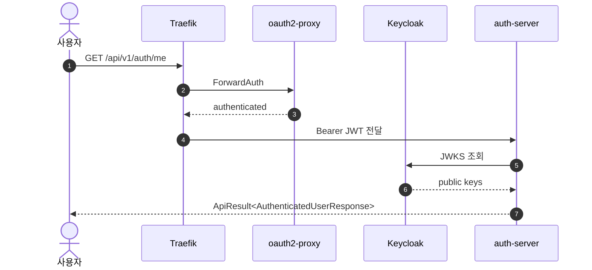

# Project-Auth-Server

Clean / Hexagonal Architecture 기반 Spring Boot 인증 서버입니다.  
브라우저 로그인과 세션 확인은 [Project-Infra](https://github.com/donghyeon-ka/project-infra)의 Ingress 계층(oauth2-proxy + Keycloak)이 담당하고, 이 서버는 Keycloak이 발급한 JWT를 Spring Security Resource Server로 다시 검증합니다.

현재는 local / dev 환경에서 구조와 테스트 게이트를 검증한 단계입니다. GitHub Actions CI 자동화와 staging / prod 배포 검증은 다음 단계로 남겨두었습니다.

이 프로젝트에서 확인하고 싶었던 질문은 세 가지입니다.

- 로그인 플로우를 애플리케이션 코드 밖으로 빼면 컨트롤러와 use case는 무엇만 책임지는가?
- `domain` / `application` / `presentation` / `infrastructure` 경계를 테스트로 강제할 수 있는가?
- 실패 응답, HTTP status, 내부 infrastructure error를 한 응답 경로에 섞지 않을 수 있는가?

| | |
|---|---|
| **Runtime** | Java 21, Spring Boot 4.0.3 |
| **Architecture** | Gradle multi-module, Clean / Hexagonal Architecture |
| **Auth** | Spring Security Resource Server, Keycloak JWT, Nimbus JWT decoder |
| **Data** | PostgreSQL 16, Spring Data JPA, Flyway |
| **Tests** | ArchUnit, JUnit 5, AssertJ, jqwik, JaCoCo, PIT |
| **Infra** | Kubernetes / Vault / Traefik 구성은 [Project-Infra](https://github.com/donghyeon-ka/project-infra)에서 관리 |

---

## Architecture


의존 방향은 `presentation / infrastructure → application → domain`입니다.  
`domain`은 Spring / JPA / Servlet을 모르고, `bootstrap`만 전체 모듈을 조립합니다.

5개 모듈로 나눈 이유는 비즈니스 규칙, use case, HTTP 계약, 외부 adapter, 실행 조립 책임을 서로 다른 변경 이유로 분리하기 위해서입니다.

레이어 규칙은 문서 약속으로만 두지 않고 [`LayerDependencyArchitectureTest`](bootstrap/src/test/java/com/project/auth/architecture/LayerDependencyArchitectureTest.java)로 검증합니다.

### Auth Flow



auth-server는 토큰을 발급하지 않습니다. Keycloak JWT의 issuer / signature / expiration / role claim을 검증하고, 검증된 principal을 application 계층으로 넘깁니다.

---

## Engineering Decisions

### 1. 로그인 플로우는 Ingress 계층에 위임

`spring-boot-starter-oauth2-client`가 아니라 `spring-boot-starter-oauth2-resource-server`만 사용합니다.  
브라우저 redirect, callback, session 확인은 oauth2-proxy + Keycloak이 담당하고, auth-server는 API 서버로서 JWT 검증에 집중합니다.

이렇게 나누면 컨트롤러는 로그인 상태를 만드는 코드가 아니라, 검증된 principal을 전제로 한 HTTP 계약에 집중할 수 있습니다.

### 2. 레이어 경계는 ArchUnit으로 검증

5개 모듈을 `domain` / `application` / `presentation` / `infrastructure` / `bootstrap`으로 분리했습니다.

대표 규칙:

- `domain`은 Spring / JPA / Servlet 의존 금지
- `application`은 presentation / infrastructure 의존 금지
- `presentation`은 infrastructure 직접 의존 금지
- `bootstrap`은 조립과 설정을 담당

잘못된 의존이 들어오면 테스트 단계에서 실패하도록 했습니다.

### 3. ErrorCode와 HTTP status 분리

`BusinessException`의 `ErrorCode`는 비즈니스 의미만 갖습니다.  
HTTP status 매핑은 presentation 계층의 [`ApiErrorHttpStatusMapper`](presentation/src/main/java/com/project/auth/presentation/support/exception/ApiErrorHttpStatusMapper.java)가 담당합니다.

application 계층이 HTTP 프로토콜 세부사항을 알지 않게 만들기 위한 결정입니다.

### 4. 내부 infrastructure error는 클라이언트 응답 계약과 분리

DB / Vault / 외부 HTTP adapter에서 발생한 내부 오류는 클라이언트 응답으로 그대로 노출하지 않습니다.  
`ErrorCode`는 sealed type이고, 클라이언트 응답에 노출 가능한 [`ClientFacingErrorCode`](application/src/main/java/com/project/auth/application/support/exception/ClientFacingErrorCode.java)와 내부 분류 전용 [`ExternalErrorCode`](application/src/main/java/com/project/auth/application/support/exception/ExternalErrorCode.java)로 갈라집니다.

[`ApiErrorHttpStatusMapper.map(...)`](presentation/src/main/java/com/project/auth/presentation/support/exception/ApiErrorHttpStatusMapper.java)는 `ClientFacingErrorCode`만 받습니다. 따라서 `InfrastructureErrorCode` 같은 내부 코드를 HTTP 응답 매퍼에 전달하는 코드는 런타임 검사가 아니라 컴파일 단계에서 거부됩니다.

실패 응답은 `ApiResult` 형태로 통일하되, 내부 원인 분류와 외부 응답 계약은 타입으로 분리했습니다.

---

## Quick Start

### H2 profile

가장 가볍게 애플리케이션 구조와 API를 확인하는 경로입니다.

```bash
./gradlew :bootstrap:bootRun
curl http://localhost:8080/actuator/health
```

### Full local infra

PostgreSQL / Keycloak / Vault까지 함께 확인하려면 로컬 docker compose 환경을 사용합니다.

```bash
docker compose -f deploy/docker/docker-compose.yml --env-file .env.local up -d
set -a; source .env.local; set +a
./gradlew :bootstrap:bootRun
curl http://localhost:8080/actuator/health
```

자세한 Keycloak 로컬 설정은 [Keycloak local setup](docs/development/keycloak/LOCAL_SETUP.md)을 참고합니다.

---

## API

| Method | Path | Auth | Response |
|---|---|---|---|
| GET | `/api/v1/auth/me` | Bearer JWT (`realm role: user`) | `ApiResult<AuthenticatedUserResponse>` |
| GET | `/actuator/health`, `/livez`, `/readyz` | Public | health / probe |
| GET | `/swagger-ui.html`, `/v3/api-docs/**` | Public | OpenAPI |

모든 비공개 endpoint는 `oauth2ResourceServer.jwt()`로 보호합니다.

---

## Build / Test

```bash
./gradlew test
./gradlew :bootstrap:test --tests LayerDependencyArchitectureTest
./gradlew :application:test
./gradlew :bootstrap:bootRun
./gradlew :bootstrap:bootJar
docker build -f deploy/docker/application/Dockerfile -t project-auth-server:local .
```

Flyway SQL은 `infrastructure/src/main/resources/db/migration/`에 둡니다.  
Kubernetes 환경에서는 이 repo가 별도 migration 이미지를 만들지 않고, [Project-Infra](https://github.com/donghyeon-ka/project-infra)에서 공식 `flyway/flyway` 이미지를 Job으로 실행합니다.

---

## Current Status

| Area | Status |
|---|---|
| Clean / Hexagonal 5 modules | 구현됨 |
| ArchUnit layer rules | 구현됨 |
| Resource Server + Keycloak JWT validation | 구현됨 |
| ErrorCode / HTTP status separation | 구현됨 |
| Coverage / mutation / property tests | JaCoCo coverageGate, PIT gate, jqwik property tests 구성 |
| OpenAPI / Swagger UI | 구현됨 |
| Local docker-compose | 구성됨 |
| Kubernetes manifests | [Project-Infra](https://github.com/donghyeon-ka/project-infra)에서 관리 |

---

## Limitations

- 사용자 도메인은 아직 작습니다. 현재 핵심 API는 `/api/v1/auth/me` 중심입니다.
- GitHub Actions CI는 아직 구성하지 않았고, 로컬 Gradle test / coverageGate / PIT 기준으로 검증합니다.
- Spring Boot 4.0.3 기반이라 actuator / observability 등 4.x 변경점은 계속 확인 중입니다.

---

## Documentation

- [docs/README.md](docs/README.md) — 문서 hub
- [docs/exception-handling-policy.md](docs/exception-handling-policy.md) — 예외 처리 13개 정책 단일 출처
- [docs/testing-coverage-policy.md](docs/testing-coverage-policy.md) — JaCoCo / PIT / jqwik Tier 분류와 임계치
- [docs/testing-history/](docs/testing-history/README.md) — 사건 단위 before/after 비교 기록
- [docs/architecture/README.md](docs/architecture/README.md) — 시스템 / 레이어 상세
- [docs/topics/02-clean-architecture/](docs/topics/02-clean-architecture/) — 레이어 경계 ADR + 5+1 계층 + sealed `ClientFacingErrorCode`
- [docs/topics/03-keycloak/](docs/topics/03-keycloak/) — Keycloak Resource Server 전환
- [docs/topics/04-logging/](docs/topics/04-logging/) — traceId (+ sentinel), structured logging, audit 단일 채널
- [docs/development/](docs/development/) — 로컬 개발 설정
