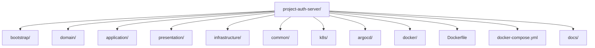
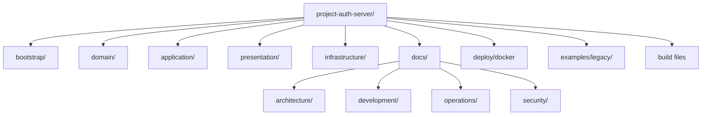

# Project-Auth-Server

인증과 인가를 담당하는 서버입니다. 이 저장소는 **애플리케이션 소스 코드와 로컬 개발 환경**을 중심으로 유지합니다.  
Kubernetes, Argo CD, Sealed Secrets 같은 운영 선언은 이제 별도 GitOps 저장소인 `Project-Auth-GitOps`에서 관리합니다.

## 아키텍처 정리

### 변경 전 구조



### 변경 전 문제점

- 소스 코드와 운영 배포 자산이 같은 저장소 루트에 섞여 있었습니다.
- `common` 모듈이 사실상 `ApiResult` 하나 때문에 존재해, 잡동사니 모듈로 커질 위험이 있었습니다.
- `application` 계층의 에러 코드가 HTTP status를 알고 있어 웹 의미가 새고 있었습니다.
- 운영 선언이 앱 repo와 GitOps repo에 동시에 남을 수 있어 source of truth가 흔들릴 여지가 있었습니다.

### 변경 후 구조



### 어떤 점이 완화되었는가

- 앱 repo는 소스와 로컬 개발 환경에 집중하고, 운영 선언은 GitOps repo로 분리했습니다.
- `ApiResult`와 성공 응답 코드를 `presentation`으로 이동해 HTTP 응답 의미를 표현 계층으로 모았습니다.
- `ErrorCode`에서 HTTP status를 제거하고, status 매핑은 `presentation`의 `ApiErrorHttpStatusMapper`가 담당하게 했습니다.
- `common` 모듈을 제거해 모호한 공통 모듈이 커질 위험을 줄였습니다.
- ArchUnit 테스트를 추가해 레이어 규칙을 실제 테스트로 검증하게 했습니다.

## 현재 폴더 구조

```text
project-auth-server/
├─ bootstrap/
├─ domain/
├─ application/
├─ presentation/
├─ infrastructure/
├─ docs/
│  ├─ architecture/
│  ├─ development/
│  ├─ operations/
│  └─ security/
├─ deploy/
│  ├─ docker/
│  └─ scripts/
├─ examples/
│  └─ legacy/
└─ build files
```

## 문서 작성 기준

문서 작성 기준은 아래 문서를 source of truth로 사용합니다.

- [docs/README.md](/home/donghyeon/dev/Project-Auth-Server/docs/README.md)
- [docs/documentation-guide.md](/home/donghyeon/dev/Project-Auth-Server/docs/documentation-guide.md)
- [docs/templates/README.md](/home/donghyeon/dev/Project-Auth-Server/docs/templates/README.md)

## 레이어 규칙

### 규칙 1

`domain`은 Spring, JPA, Controller를 모릅니다.

### 규칙 2

`application`은 “무슨 일을 한다”를 담당합니다.

### 규칙 3

`presentation`은 HTTP 입출력과 응답 계약만 담당합니다.

### 규칙 4

`infrastructure`는 기술 구현체만 담당합니다.

### 규칙 5

`bootstrap`이 전부 조립합니다.

### 규칙 6

배포/운영 파일은 앱 소스 바깥 저장소 또는 `deploy/` 아래로 분리합니다.

### 규칙 7

문서는 `architecture / development / operations / security`로 분리합니다.

이 규칙은 [LayerDependencyArchitectureTest.java](/home/donghyeon/dev/Project-Auth-Server/bootstrap/src/test/java/com/project/auth/architecture/LayerDependencyArchitectureTest.java)에서 ArchUnit으로 검증합니다.

## 소스 모듈

- `bootstrap`
  - 애플리케이션 진입점과 설정 조립을 담당합니다.
- `domain`
  - 엔티티, 값 객체, 도메인 예외, 도메인 정책을 둡니다.
- `application`
  - 유스케이스, 커맨드/결과 DTO, 포트를 둡니다.
- `presentation`
  - Controller, 요청/응답 DTO, 응답 래퍼, HTTP 예외 매핑을 둡니다.
- `infrastructure`
  - JPA, 외부 시스템, 보안/토큰 같은 기술 구현체를 둡니다.

## 로컬 개발 환경

로컬 인프라는 [deploy/docker/docker-compose.yml](/home/donghyeon/dev/Project-Auth-Server/deploy/docker/docker-compose.yml)로 띄웁니다.

```bash
docker compose -f deploy/docker/docker-compose.yml --env-file .env.local up -d
```

애플리케이션 실행:

```bash
set -a
source .env.local
set +a

./gradlew :bootstrap:bootRun
```

주요 로컬 참고 문서:

- [docs/development/keycloak/LOCAL_SETUP.md](/home/donghyeon/dev/Project-Auth-Server/docs/development/keycloak/LOCAL_SETUP.md)
- [docs/development/vault-local-setup.md](/home/donghyeon/dev/Project-Auth-Server/docs/development/vault-local-setup.md)
- [docs/development/postman/auth-core.postman_collection.json](/home/donghyeon/dev/Project-Auth-Server/docs/development/postman/auth-core.postman_collection.json)

## 이미지 빌드

이미지 빌드는 [deploy/docker/Dockerfile](/home/donghyeon/dev/Project-Auth-Server/deploy/docker/Dockerfile)을 사용합니다.

```bash
docker build -f deploy/docker/Dockerfile -t project-auth-server:local .
```

현재 Dockerfile은:

1. `application.jar`
2. `migration.jar`

두 개를 함께 만들고, 마이그레이션 전용 바이너리도 같이 포함합니다.

## 운영 자산 관리 원칙

이 repo는 더 이상 Kubernetes/Argo CD 운영 선언을 source of truth로 들고 있지 않습니다.

- 앱 repo: 소스 코드, 로컬 docker 개발 환경
- GitOps repo (`Project-Auth-GitOps`): Kubernetes manifest, Argo CD application, SealedSecret, 환경별 overlay

즉 운영 변경은 `Project-Auth-GitOps`에서 관리하고, 이 repo의 CI는 이미지 빌드와 푸시까지만 담당합니다.
