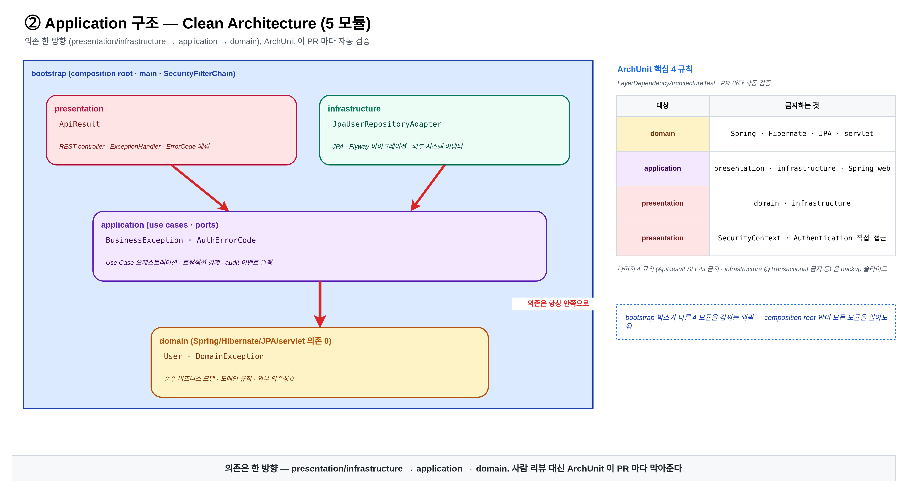
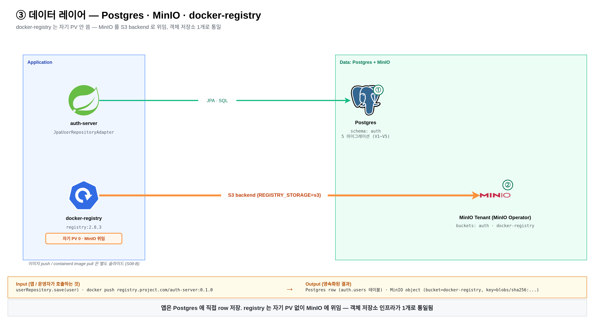
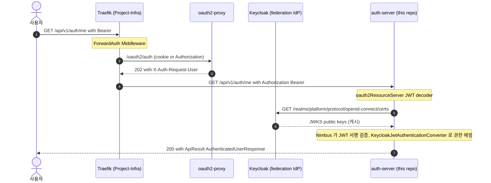

# Project-Auth-Server

Clean / Hexagonal Architecture 기반 Spring Boot 4 인증 서버. 브라우저 로그인과 세션 확인은 [Project-Infra](https://github.com/donghyeon-ka/project-infra) 의 Ingress 단 oauth2-proxy 가 담당하고, auth-server 는 Keycloak 이 발급한 JWT 를 Spring Security Resource Server 로 직접 검증하는 구조로 단순화했다.

| | |
|---|---|
| **언어 / 런타임** | Java 21, Spring Boot 4.0.3 |
| **빌드** | Gradle multi-module — `bootstrap` / `domain` / `application` / `presentation` / `infrastructure` |
| **인증** | Keycloak (Google / GitHub federation), Spring Security ResourceServer (JWT) |
| **토큰 처리** | Spring OAuth2 ResourceServer + Nimbus JWT decoder — JWKS via Keycloak. 이 서버는 토큰을 *발급* 하지 않고 *검증만* 한다 |
| **데이터** | PostgreSQL 16, Flyway, Spring Data JPA |
| **검증** | ArchUnit (레이어 의존성), JUnit 5 + AssertJ |
| **인프라** | [Project-Infra](https://github.com/donghyeon-ka/project-infra) repo 가 K8s / Vault / Traefik / Keycloak Operator 운영 |

---

## Why I Built This

> 백엔드 코드의 인증 로직을 *코드에서 사라지게* 하면, 컨트롤러는 무엇만 책임지는가?

대부분의 Spring auth 예제는 OAuth2 Login + 세션 + JWT 검증을 컨트롤러 가까이 두고 *"인증은 서버 안에서 처리"* 한다. 그러나 인증 정책이 바뀔 때마다 코드 PR 이 필요하고, 단위 테스트는 인증을 mock 해야 한다.

이 프로젝트는 정반대 방향으로 갔다. **로그인 / 세션 확인은 [Project-Infra](https://github.com/donghyeon-ka/project-infra) 의 Ingress 단 oauth2-proxy 가 담당** 하고, auth-server 는 Keycloak 이 발급한 JWT 를 Spring Security Resource Server 로 다시 검증한다. 결과:

- 컨트롤러는 로그인 플로우를 직접 다루지 않고, 인증된 principal 과 권한 조건을 전제로 HTTP 계약에 집중한다
- Resource Server 가 JWKS 를 캐시하면서 토큰 서명 / 만료 / issuer 를 검증한다
- 인증 흐름을 use case 내부로 끌고 들어오지 않아, application 계층 테스트가 인증 mock 에 의존하지 않도록 분리했다

부수적으로 다음을 다루게 됐다:

- Clean / Hexagonal 5 모듈 + ArchUnit 으로 레이어 위반 자동 차단
- Domain 이 Spring / JPA / Servlet 을 모르는 진짜 격리
- ErrorCode 가 HTTP status 를 모르는 *web 의미 누수 방지*

---

## Architecture



화살표는 *의존 방향*. domain 은 어떤 모듈에도 의존하지 않는다 (의존 0). bootstrap 만 모든 모듈을 알고 조립한다. ArchUnit 4 규칙으로 PR 마다 자동 차단 — [`LayerDependencyArchitectureTest`](bootstrap/src/test/java/com/project/auth/architecture/LayerDependencyArchitectureTest.java).

### 데이터 레이어



이 repo 는 그림 좌측 (Spring `auth-server` → `JpaUserRepositoryAdapter` → Postgres `auth` schema, V1~V5 Flyway 마이그레이션) 만 담당한다. 우측의 `docker-registry` / `MinIO` 는 [Project-Infra](https://github.com/donghyeon-ka/project-infra) 가 운영하는 인프라.

---

## Quick Start

> **예상 소요**: 5 분 (로컬 H2 프로필 기준).

```bash
# 1. 로컬 의존 인프라 (Postgres, Keycloak, Vault) — H2 프로필이면 생략 가능
docker compose -f deploy/docker/docker-compose.yml --env-file .env.local up -d

# 2. 환경 변수 로드
set -a; source .env.local; set +a

# 3. 실행
./gradlew :bootstrap:bootRun

# 4. 헬스체크
curl http://localhost:8080/actuator/health
```

다른 프로필 / 시나리오: [docs/development/keycloak/LOCAL_SETUP.md](docs/development/keycloak/LOCAL_SETUP.md), [docs/development/vault-local-setup.md](docs/development/vault-local-setup.md).

---

## API

| Method | Path | 인증 | 응답 |
|---|---|---|---|
| GET | `/api/v1/auth/me` | Bearer JWT (realm role `user`) | `ApiResult<AuthenticatedUserResponse>` — Keycloak claims + DB 동기화된 사용자 |
| GET | `/actuator/health`, `/actuator/health/**` | Public | health 상태 |
| GET | `/livez`, `/readyz` | Public | K8s liveness / readiness |
| GET | `/swagger-ui.html`, `/swagger-ui/**` | Public | Swagger UI |
| GET | `/v3/api-docs/**` | Public | OpenAPI 스펙 |

> 모든 비공개 endpoint 는 `oauth2ResourceServer.jwt()` 로 보호. JWT 없이 접근 시 [`SecurityExceptionHandler`](bootstrap/src/main/java/com/project/auth/config/auth/security/SecurityExceptionHandler.java) 가 `ApiResult.fail` 형태로 응답.

### 인증 흐름 (Keycloak federation 후 ResourceServer 도달)



> Cold/warm path 와 ForwardAuth 자세한 흐름은 [Project-Infra forward-auth 시퀀스](https://github.com/donghyeon-ka/project-infra/tree/main/docs/diagrams/sequence).

---

## Highlighted Engineering Decisions

설명을 길게 늘어놓는 대신 결정 4 개와 *왜 그렇게 했는가* 만 남긴다.

### 1. Clean / Hexagonal 5 모듈 + ArchUnit 강제

domain / application / presentation / infrastructure / bootstrap 5 모듈을 Gradle multi-project 로 분리. **layer 위반은 PR 마다 ArchUnit 이 컴파일 단계에서 자동 차단** ([`LayerDependencyArchitectureTest`](bootstrap/src/test/java/com/project/auth/architecture/LayerDependencyArchitectureTest.java)). 결과: `presentation → infrastructure` 같은 잘못된 의존이 들어오면 PR 빌드가 빨갛게 됨. *문서로 약속하는 게 아니라 코드로 강제하는 차이*.

### 2. ErrorCode 가 HTTP status 를 모른다

`BusinessException` 의 `ErrorCode` 는 *비즈니스 의미만* 갖는다 (code + message). HTTP status 매핑은 presentation 의 [`ApiErrorHttpStatusMapper`](presentation/src/main/java/com/project/auth/presentation/support/exception/ApiErrorHttpStatusMapper.java) 가 책임. **결과: application 코드가 web 프로토콜에 누설되지 않는다**. 같은 `ErrorCode` 가 다른 채널 (gRPC / 메시지 큐) 에 가도 의미 그대로.

### 3. 로그인 플로우는 Ingress 단에 위임 — auth-server 는 Resource Server 로서 JWT 검증

`spring-boot-starter-oauth2-client` 가 아니라 `spring-boot-starter-oauth2-resource-server` 만 사용. 브라우저 로그인 / OAuth2 redirect / callback / 세션 확인은 Ingress 단의 oauth2-proxy + Keycloak 이 담당하고, auth-server 는 Keycloak 이 발급한 JWT 를 Resource Server 로 다시 검증한다 — 즉 *Ingress 게이트* 와 *백엔드 검증* 의 이중 경계. 토큰 검증은 Nimbus + JWKS, claim → principal 변환은 [`KeycloakJwtAuthenticationConverter`](bootstrap/src/main/java/com/project/auth/config/auth/security/KeycloakJwtAuthenticationConverter.java) 가 담당. 인증 흐름 그림은 위 시퀀스 참고.

### 4. Common 모듈을 만들지 않는다

이 repo 는 의도적으로 `common` 모듈이 없다. 처음에는 있었지만, *"잡동사니 모듈로 커지는 위험"* 을 받아들이지 않고 제거. `ApiResult` 같은 공유 타입은 *책임 위치* 를 정해 그곳에 두고 (presentation), 모듈 간 *공통* 이라는 이유만으로 별도 모듈을 만들지 않는다.

---

## Layer Dependency Rules (ArchUnit 검증)

| # | 모듈 | 규칙 |
|:---:|---|---|
| 1 | `domain` | Spring / JPA / Servlet / Controller 를 모름. 의존성 0 |
| 2 | `application` | "무슨 일을 한다" — use case + port. presentation / infrastructure 의존 금지 |
| 3 | `presentation` | HTTP 입출력 + 응답 계약. infrastructure 의존 금지 |
| 4 | `infrastructure` | 기술 구현체 (JPA / Vault / Nimbus). application port 만 구현 |
| 5 | `bootstrap` | 전체 조립 + Spring `@Configuration`. presentation 이 직접 알 수 없는 기술 예외 (Security / Infrastructure) 의 HTTP 경계 변환도 여기 |

→ [`LayerDependencyArchitectureTest`](bootstrap/src/test/java/com/project/auth/architecture/LayerDependencyArchitectureTest.java) 가 PR 마다 자동 검증.

## Repo Organization Rules

| # | 규칙 |
|:---:|---|
| 6 | 배포 / 운영 매니페스트는 [Project-Infra](https://github.com/donghyeon-ka/project-infra) repo 또는 `deploy/` 아래로 분리. 이 repo 는 source code + 로컬 docker-compose 만 |
| 7 | 문서는 `docs/architecture/` / `docs/topics/` (ADR + 런북) / `docs/development/` (로컬 셋업) / `docs/standards/` + `docs/examples/` (코딩 가이드) / `docs/templates/` 로 분리 |

---

## Folder Structure (요약)

```text
project-auth-server/
├── bootstrap/         # Spring Boot 진입점, @Configuration, security filter chain
├── presentation/      # Controller, request/response DTO, ErrorCode → HTTP 매핑
├── application/       # use case, port (in/out), command/result
├── domain/            # 엔티티, VO, 도메인 규칙. 의존성 0
├── infrastructure/    # JPA / Vault Transit / Nimbus / Flyway 마이그레이션 SQL
├── deploy/docker/     # 로컬 docker-compose + 애플리케이션 Dockerfile
└── docs/              # architecture / development / topics / standards / examples / publish / templates
```

세부는 [docs/architecture/README.md](docs/architecture/README.md).

---

## Build / Test

```bash
./gradlew build -x test                                                 # 전체 빌드 (테스트 제외)
./gradlew test                                                          # 전체 테스트
./gradlew :bootstrap:test --tests LayerDependencyArchitectureTest       # ArchUnit 단독
./gradlew :application:test                                             # application 모듈만
./gradlew :bootstrap:bootRun                                            # 로컬 실행
./gradlew :bootstrap:bootJar                                            # 실행 jar
docker build -f deploy/docker/application/Dockerfile -t project-auth-server:local .
```

> Flyway 마이그레이션은 `infrastructure/src/main/resources/db/migration/` 에 SQL 만 두고, K8s 에서는 공식 `flyway/flyway` 이미지를 initContainer 로 실행한다. 이 repo 에는 별도 migration 진입점 / 이미지를 두지 않는다 — 운영 절차는 [Project-Infra guide §10](https://github.com/donghyeon-ka/project-infra/blob/main/guide.md#10-마이그레이션-실행-flyway).

---

## Current Status

| 영역 | 상태 |
|---|---|
| Clean / Hexagonal 5 모듈 + ArchUnit | 구현됨 |
| Spring Security Resource Server + Keycloak JWT 검증 | 구현됨 |
| ErrorCode / HTTP status 분리 | 구현됨 |
| OpenAPI / Swagger UI | 구현됨 |
| 로컬 docker-compose (Postgres / Keycloak / Vault) | 구성됨 |
| K8s 운영 매니페스트 | 별도 [Project-Infra](https://github.com/donghyeon-ka/project-infra) |

---

## Limitations (honest scope)

- **사용자 도메인이 빈약**: 현재는 `/api/v1/auth/me` 한 endpoint 가 *Keycloak claims + DB 동기화된 사용자* 를 반환하는 수준. 사용자 도메인의 진짜 비즈니스 로직 (권한 그룹 / 회원 생애 / 이력) 은 미구현.
- **테스트 커버리지 정량 측정 미진행**: JaCoCo 등으로 % 측정 안 함. ArchUnit + 모듈별 단위 테스트만.
- **CI 미구성**: GitHub Actions workflow 없음. 로컬 `./gradlew test` 만.
- **Spring Boot 4.0.3 GA 직후**: 일부 의존성 (특히 actuator / observability) 의 4.0 변경점 반영 검증 미진행.

---

## 보조 문서

- [docs/README.md](docs/README.md) — 문서 hub
- [docs/architecture/README.md](docs/architecture/README.md) — 시스템 / 레이어 상세
- [docs/topics/02-clean-architecture/](docs/topics/02-clean-architecture/) — 레이어 경계 ADR + ErrorCode/HTTP 분리
- [docs/topics/03-keycloak/](docs/topics/03-keycloak/) — Keycloak ResourceServer 전환 ADR + 자체 JWT/Vault Transit 제거 inventory
- [docs/topics/04-logging/](docs/topics/04-logging/) — MDC traceId, structured logging, audit log 설계 + 운영 런북
- [docs/development/](docs/development/) — 로컬 Keycloak realm / Postman collection
