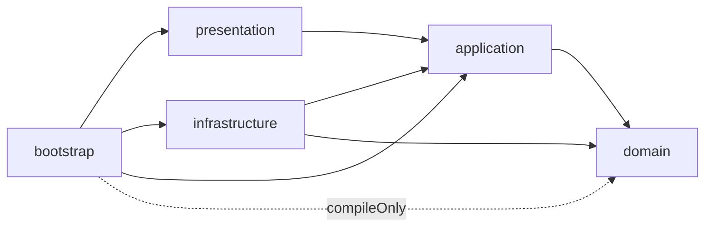
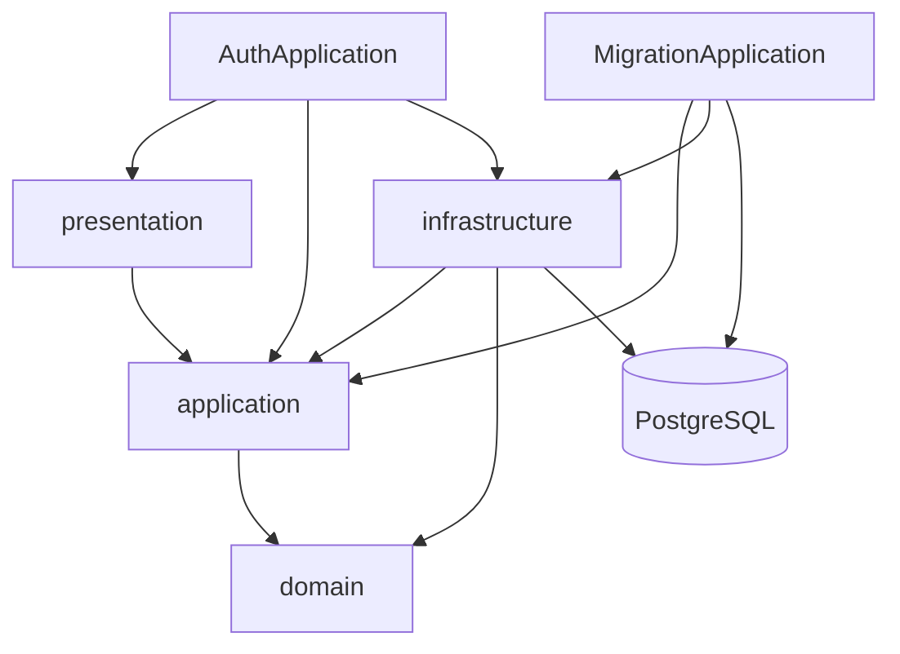

# Architecture

`Project-Auth-Server`는 Clean Architecture 기준으로 레이어를 나누고, Spring Boot는 `bootstrap`에서만 조립하는 구조를 목표로 합니다.

## 한눈에 보는 의존 흐름

핵심은 **의존 방향이 항상 안쪽으로만 흐른다**는 점입니다.

- `domain`은 가장 안쪽에 있고 아무 것도 모릅니다.
- `application`은 유스케이스와 포트를 통해 도메인 규칙을 조합합니다.
- `presentation`, `infrastructure`는 바깥쪽 어댑터로서 `application`에 의존합니다.
- `bootstrap`은 실제 Spring Boot 실행 모듈로, 바깥 레이어들을 조립합니다.

## 레이어별 책임

### domain

도메인 모델과 순수 규칙만 둡니다.

- 예: `User`, `UserEmail`, `UserName`, `UserPasswordPolicy`
- 금지: Spring annotation, JPA annotation, HTTP/Servlet 타입

### application

“무슨 일을 한다”를 담당합니다.

- 유스케이스
- 커맨드/결과 DTO
- 포트(`port/in`, `port/out`)
- 비즈니스 에러 코드/예외

여기서는 더 이상 HTTP status를 다루지 않습니다.  
에러는 `code`, `message`만 가지고 있고, HTTP status 매핑은 바깥쪽 `presentation`에서 담당합니다.

### presentation

HTTP 입출력과 API 응답 계약만 담당합니다.

- Controller
- Request/Response DTO
- `ApiResult`
- `ApiSuccessCode`
- `GlobalExceptionHandler`
- `ApiErrorHttpStatusMapper`

즉 API 응답 모양과 HTTP status는 이 레이어의 책임입니다.

### infrastructure

기술 구현체만 담당합니다.

- JPA repository adapter
- persistence mapper/entity
- password encoder adapter
- JWT/Vault integration

즉 `application`이 정의한 포트를 실제 기술로 연결합니다.

### bootstrap

전체를 조립합니다.

- Spring Boot entrypoint
- configuration
- security wiring
- migration 전용 app entrypoint

이 프로젝트에서는 일반 웹 애플리케이션 진입점과 별도로 `MigrationApplication`을 둬서 DB migration을 전용 실행 단위로 분리했습니다.

## 웹 앱과 migration 앱

이 구조의 의도는 이렇습니다.

- 웹 앱은 `presentation + application + infrastructure`를 조립
- migration 앱은 웹 어댑터 없이 DB migration만 수행

즉 migration을 위해 auth-server 전체 웹 컨텍스트를 억지로 띄우지 않도록 분리했습니다.

## 왜 이런 구조를 택했는가

이 구조로 얻는 이점은 다음과 같습니다.

- 도메인/유스케이스가 웹 프레임워크에 오염되지 않습니다.
- 기술 교체(JPA, Vault, Token 발급 방식 등)의 영향 범위를 `infrastructure`로 제한할 수 있습니다.
- 응답 계약과 비즈니스 규칙의 경계를 분명히 할 수 있습니다.
- migration 같은 운영성 실행을 별도 진입점으로 분리할 수 있습니다.

## 테스트로 강제하는 규칙

구조는 설명만으로 유지되지 않기 때문에, ArchUnit 테스트로 핵심 규칙을 검증합니다.

- 위치: `bootstrap/src/test/java/com/project/auth/architecture/LayerDependencyArchitectureTest.java`

현재 강제하는 규칙:

- `domain`은 Spring/JPA/Servlet에 의존하지 않는다
- `application`은 `presentation`/`infrastructure`에 의존하지 않는다
- `presentation`은 `infrastructure`에 직접 의존하지 않는다
- `bootstrap`만 `config` 패키지를 조립 지점으로 사용한다

즉 이 문서는 “설계 설명”이고, ArchUnit은 “설계 위반 방지 장치”입니다.
