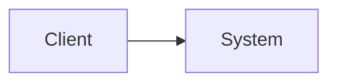
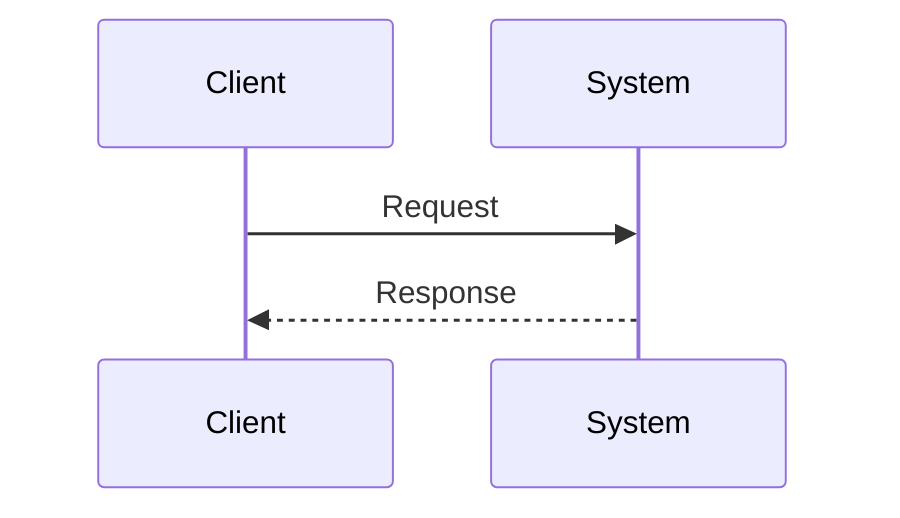

# [주제명] 아키텍처

## 1. Context & Scope

### 목적

이 문서가 설명하려는 범위를 적습니다.

### Scope

- 포함:
- 제외:

## 2. Why

- 이 구조가 해결하려는 문제는 무엇인가?
- 대안 구조는 무엇이었는가?
- 왜 이 구조를 선택했는가?

## 3. Goals & Non-Goals

### Goals

- 

### Non-Goals

- 

## 4. Architecture Overview

### 4.1 전체 구조

### 4.2 핵심 컴포넌트

- 컴포넌트 A:
- 컴포넌트 B:

## 5. How It Works

### 5.1 요청/데이터 흐름

### 5.2 상세 설계

- 단계 1:
- 단계 2:

## 6. Alternatives Considered

### 대안 1

- 장점:
- 단점:
- 왜 선택하지 않았는가:

### 대안 2

- 장점:
- 단점:
- 왜 선택하지 않았는가:

## 7. Cross-cutting Concerns

- 성능:
- 보안:
- 테스트:
- 운영:

## 8. Result / Trade-offs

- 얻은 이점:
- 감수한 비용:
- 남은 리스크:

## 9. References

- 관련 코드:
- 관련 문서:
