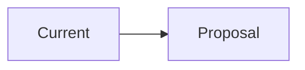

# RFC: [제안 제목]

## 1. Problem

- 어떤 문제가 있는가?
- 현재 방식의 한계는 무엇인가?

## 2. Goals

- 

## 3. Non-Goals

- 

## 4. Proposal

제안하는 해결 방안을 적습니다.

## 5. Detailed Design

### 구조

### 핵심 변경점

- 

## 6. Alternatives Considered

### 대안 1

- 장점:
- 단점:

### 대안 2

- 장점:
- 단점:

## 7. Validation Plan

- 어떻게 검증할 것인가?
- 어떤 테스트/지표를 볼 것인가?

## 8. Rollout Plan

- 단계별 적용 계획
- 롤백 조건

## 9. Risks

- 
