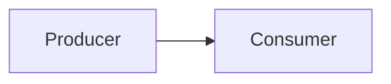

# Tech Spec: [기능 또는 시스템명]

## 1. Background

- 비즈니스/기술 배경
- 현재 시스템의 한계

## 2. Requirements

### Functional Requirements

- 

### Non-Functional Requirements

- 성능:
- 보안:
- 가용성:

## 3. Architecture

## 4. Data Model

- 주요 엔티티:
- 상태 전이:
- 저장소/캐시 전략:

## 5. API / Interface

- 입력:
- 출력:
- 에러 모델:

## 6. Operational Considerations

- 배포:
- 모니터링:
- 장애 대응:

## 7. Risks & Trade-offs

- 

## 8. Test Plan

- 단위 테스트:
- 통합 테스트:
- 운영 검증:

## 9. Rollout Plan

- 
