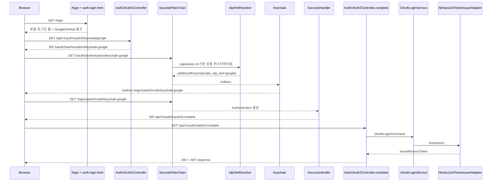

# Spring Security 아키텍처

## 1. Context & Scope

### 목적

이 문서는 `Project-Auth-Server`에서 Spring Security가 어떤 책임을 맡고, `/login` 커스텀 로그인 페이지, OAuth2 redirect/callback, `/api/v1/auth/oauth2/complete`, JWT 발급, OIDC discovery가 어떻게 이어지는지 코드 기준으로 설명합니다.  
목표는 신규 팀원이 아래 질문에 답할 수 있게 만드는 것입니다.

- 왜 `/login`이 브라우저 로그인 진입점인가?
- 왜 OAuth2 callback 뒤에 `/complete`가 한 번 더 호출되는가?
- 어디까지가 Spring Security이고, 어디서부터 우리 애플리케이션 서비스인가?

### Scope

- 포함:
  - `SecurityFilterChain`의 공개/보호 경로
  - `/login` 커스텀 로그인 진입점과 `auth-login.html`
  - OAuth2 authorization redirect/callback과 `kc_idp_hint`
  - callback 이후 `Authentication`을 애플리케이션 유스케이스로 넘기는 경계
  - JWT signer, JWK, OIDC discovery로 이어지는 구조
- 제외:
  - Keycloak broker 내부 설정 상세
  - Vault 설치/운영 절차
  - RBAC, resource server, refresh token 설계

## 2. Why

- 이 서버는 브라우저 redirect 기반 OAuth2 login과 로컬 로그인 API를 함께 제공합니다.
- OAuth2 authorization request 저장, callback 검증, 인증 객체 구성, failure handling을 직접 구현하면 보안 리스크와 유지보수 비용이 커집니다.
- 반대로 모든 인증 후처리와 토큰 정책을 framework 또는 Keycloak에 밀어 넣으면 계정 충돌 정책, 사용자 등록, JWT claim 구성을 우리 코드가 통제하기 어려워집니다.
- 그래서 HTTP 보안 진입과 프로토콜 처리는 Spring Security에 맡기고, 사용자 검증과 토큰 발급은 application service로 남기는 구조가 필요했습니다.

## 3. Goals & Non-Goals

### Goals

- 브라우저 사용자가 `/login` 하나만 알아도 로컬 로그인과 소셜 로그인을 시작할 수 있게 합니다.
- OAuth2 redirect/callback은 Spring Security 기본 흐름을 최대한 활용합니다.
- callback 이후 사용자 조회/생성/JWT 발급은 명시적 유스케이스로 유지합니다.
- 토큰 서명 키는 로컬 RSA와 Vault Transit 사이에서 교체 가능해야 합니다.

### Non-Goals

- 로컬 로그인까지 Spring Security `AuthenticationProvider` 체인 안으로 넣는 것
- 역할 기반 인가나 method security를 현재 문서 범위에서 구현하는 것
- OAuth2 Authorization Server 전체 기능을 제공하는 것
- OAuth2 로그인 전체를 완전 stateless로 만드는 것

## 4. Architecture Overview

### 4.1 전체 구조

```mermaid
flowchart LR
  Browser["Browser"] -->|GET /login| LoginPage["AuthLoginPageController -> auth-login.html"]
  LoginPage -->|POST /api/v1/auth/login| LoginController["AuthLoginController"]
  LoginPage -->|GET /api/v1/auth/oauth2/keycloak/google| StartController["AuthOAuth2Controller"]
  LoginPage -->|GET /api/v1/auth/oauth2/keycloak/github| StartController

  Browser --> Chain["SecurityFilterChain"]
  StartController -->|302 /oauth2/authorization/*| Chain
  Chain --> OAuthClient["Spring Security OAuth2 Client"]
  OAuthClient --> Resolver["KeycloakIdpHintAuthorizationRequestResolver"]
  Resolver --> Keycloak["Keycloak Realm / Broker"]
  Keycloak --> Provider["Google / GitHub"]
  Provider --> Keycloak
  Keycloak -->|GET /login/oauth2/code/*| Chain
  Chain --> Success["OAuth2LoginSuccessHandler"]
  Success -->|302 /api/v1/auth/oauth2/complete| Browser
  Browser --> CompleteController["AuthOAuth2Controller.complete"]

  LoginController --> LoginSvc["LoginService"]
  CompleteController --> Mapper["OAuth2AuthenticationCommandMapper"]
  Mapper --> OAuthSvc["OAuthLoginService"]

  LoginSvc --> UserRepo["JpaUserRepositoryAdapter"]
  OAuthSvc --> UserRepo
  LoginSvc --> TokenIssuer["NimbusJwtTokenIssuerAdapter"]
  OAuthSvc --> TokenIssuer
  TokenIssuer --> Signer["JWSSigner"]
  Signer --> KeySource["ConfiguredJwtSigningKeySource or VaultTransitJwtSigningKeySource"]
  KeySource --> Discovery["ConfiguredOpenIdDiscoveryDocumentProvider"]
  Discovery --> OpenId["/.well-known/openid-configuration"]
  Discovery --> Jwks["/.well-known/jwks.json"]
```



### 4.2 핵심 컴포넌트

- `OAuth2SecurityConfiguration`:
  공개/보호 경로를 선언하고, `oauth2Login()`에 resolver/success/failure handler를 연결합니다.
- `AuthLoginPageController` + `auth-login.html`:
  브라우저 로그인 허브입니다. 로컬 로그인 API와 Google/GitHub 시작 링크를 같은 화면에 모읍니다.
- `KeycloakIdpHintAuthorizationRequestResolver`:
  registration id에 따라 `kc_idp_hint`를 추가합니다.
- `OAuth2LoginSuccessHandler`:
  callback 성공 후 즉시 JSON을 만들지 않고 `/api/v1/auth/oauth2/complete`로 이동시킵니다.
- `AuthOAuth2Controller` + `OAuth2AuthenticationCommandMapper`:
  Spring Security의 `Authentication`을 애플리케이션용 `OAuthLoginCommand`로 변환합니다.
- `LoginService`, `OAuthLoginService`:
  provider 정책, 계정 충돌 검증, 신규 사용자 등록, 토큰 발급 호출을 담당합니다.
- `NimbusJwtTokenIssuerAdapter`:
  RS256 access token을 발급합니다.
- `ConfiguredOpenIdDiscoveryDocumentProvider`:
  issuer, `jwks_uri`, 지원 알고리즘 정보를 공개합니다.

## 5. How It Works

### 5.1 요청/데이터 흐름



### 5.2 상세 설계

#### 브라우저 진입점

- `oauth2Login().loginPage("/login")`이 선언되어 있어 브라우저 기준 로그인 진입점은 `/login`입니다.
- `AuthLoginPageController`는 `/`와 `/login`을 `forward:/auth-login.html`로 연결합니다.
- 정적 페이지 `auth-login.html`은 아래 세 가지를 한 화면에 묶습니다.
  - 로컬 로그인 폼
  - `GET /api/v1/auth/oauth2/keycloak/google`
  - `GET /api/v1/auth/oauth2/keycloak/github`

#### 공개 경로와 보호 경로

`SecurityFilterChain`은 아래 경로를 `permitAll`로 엽니다.

- `/`, `/login`, `/auth-login.html`
- `/actuator/health`, `/actuator/health/**`, `/livez`, `/readyz`
- `/.well-known/**`
- `/swagger-ui.html`, `/swagger-ui/**`, `/v3/api-docs/**`
- `/api/v1/users/signup`
- `/api/v1/auth/login`
- `/api/v1/auth/oauth2/keycloak/**`
- `/oauth2/authorization/**`
- `/login/oauth2/code/**`

그 외의 모든 요청은 `authenticated()`입니다.  
특히 `/api/v1/auth/oauth2/complete`는 공개 경로가 아니므로 callback 이후 인증 상태가 유지되어야만 접근할 수 있습니다.

아래는 실제 `OAuth2SecurityConfiguration.securityFilterChain()` 코드입니다.

```java
// OAuth2SecurityConfiguration.java — SecurityFilterChain 핵심 구성
return http
    .csrf(csrf -> csrf.disable())
    .authorizeHttpRequests(authorize -> authorize
        .requestMatchers(
            "/", "/login", "/auth-login.html",
            "/actuator/health", "/actuator/health/**",
            "/livez", "/readyz",
            "/.well-known/**",
            "/swagger-ui.html", "/swagger-ui/**", "/v3/api-docs/**",
            "/api/v1/users/signup",
            "/api/v1/auth/login",
            "/api/v1/auth/oauth2/keycloak/**",
            "/oauth2/authorization/**",
            "/login/oauth2/code/**"
        ).permitAll()
        .anyRequest().authenticated()
    )
    .oauth2Login(oauth2 -> oauth2
        .loginPage("/login")
        .authorizationEndpoint(authorization -> authorization
            .authorizationRequestResolver(keycloakIdpHintAuthorizationRequestResolver))
        .successHandler(oAuth2LoginSuccessHandler)
        .failureHandler(oAuth2LoginFailureHandler)
    )
    .build();
```

이 코드에서 주목할 점은 `loginPage("/login")`이 브라우저 로그인 진입점을 커스텀 페이지로 지정하고, `authorizationRequestResolver`에 `kc_idp_hint`를 주입하는 resolver를 연결한다는 것입니다.

#### Spring Security와 application service의 경계

Spring Security가 맡는 부분:

- 공개/보호 경로 분리
- `/login` 커스텀 로그인 페이지 진입
- OAuth2 authorization redirect/callback 처리
- OAuth2 성공/실패 후처리 연결
- callback 이후 `Authentication` 유지

애플리케이션 서비스가 맡는 부분:

- 로컬 이메일/비밀번호 검증
- 소셜 사용자 조회/등록
- 계정 충돌 판단
- JWT claim 생성과 발급

#### 현재 구조의 기본값과 제약

- 세션 관리:
  명시적 `SessionCreationPolicy.STATELESS`가 없으므로 OAuth2 authorization request와 callback 이후 인증 상태 유지에 기본 세션 모델을 사용합니다.
- CSRF:
  현재는 비활성화돼 있습니다. 브라우저 상태 변경 API가 늘어나면 재검토가 필요합니다.
- CORS:
  커스텀 설정이 없습니다. same-origin 전제가 강합니다.
- Method security:
  `@EnableMethodSecurity`, `@PreAuthorize`, `hasRole` 계열이 없습니다.
- provider 추론:
  `OAuth2AuthenticationCommandMapper`가 `authorizedClientRegistrationId` 문자열에 `google` 또는 `github`가 포함되는지 보고 provider를 결정합니다.

## 6. Alternatives Considered

### 대안 1

- 구조:
  OAuth2 redirect/callback과 인증 상태 관리까지 custom servlet filter/controller로 직접 구현
- 장점:
  framework 의존을 더 얕게 가져갈 수 있습니다.
- 단점:
  authorization request 저장, callback 검증, `SecurityContext` 구성, 예외 처리까지 모두 직접 책임져야 합니다.
- 왜 선택하지 않았는가:
  현재 요구사항에서 얻는 이점보다 프로토콜 구현 리스크가 더 컸습니다.

### 대안 2

- 구조:
  Keycloak에 사용자 등록, 토큰 발급, 후처리 로직까지 더 많이 위임하고 auth-server는 thin proxy처럼 유지
- 장점:
  애플리케이션 코드량은 줄어듭니다.
- 단점:
  계정 충돌 정책, JWT claim 정책, signer 교체 전략을 우리 코드가 통제하기 어렵습니다.
- 왜 선택하지 않았는가:
  이 프로젝트는 인증 결과와 토큰 정책을 애플리케이션 도메인에서 소유해야 했습니다.

## 7. Cross-cutting Concerns

- 성능:
  filter chain 커스터마이징은 resolver/handler 수준으로 작습니다. 다만 Vault signer를 켜면 토큰 발급 시 네트워크 홉이 추가됩니다.
- 보안:
  `/api/v1/auth/oauth2/complete`는 보호 경로이며, 이메일과 `(provider, provider_subject)`는 DB unique constraint로 보호됩니다.
- 테스트:
  `/login` 노출, OAuth2 controller, discovery/JWK는 테스트로 검증됩니다.
- 운영:
  `issuer`와 `kid`가 외부 검증자와 반드시 일치해야 하며, 로컬 생성 키는 재시작 시 바뀔 수 있으므로 개발 환경에만 적합합니다.

## 8. Result / Trade-offs

- 얻은 이점:
  - 표준 OAuth2/OIDC 프로토콜 처리를 재구현하지 않아도 됩니다.
  - 로컬 로그인과 소셜 로그인 후처리를 명시적 유스케이스로 유지할 수 있습니다.
  - JWT signer를 로컬 RSA와 Vault Transit 사이에서 교체할 수 있습니다.
  - `/login` 화면이 브라우저 로그인 허브 역할을 해 온보딩이 쉬워집니다.
- 감수한 비용:
  - OAuth2 callback과 `/complete`가 분리돼 있어 흐름을 처음 보면 어렵습니다.
  - OAuth2 로그인은 세션에 의존하므로 완전 stateless하지 않습니다.
  - registration id naming 규칙과 provider 추론 로직이 결합돼 있습니다.
- 남은 리스크:
  - RBAC, resource server, refresh token은 아직 없습니다.
  - 외부 SPA 또는 cross-origin 브라우저 시나리오가 들어오면 CORS/CSRF 전략을 다시 잡아야 합니다.

## 9. References

- 관련 코드:
  - `bootstrap/src/main/java/com/project/auth/config/auth/OAuth2SecurityConfiguration.java`
  - `presentation/src/main/java/com/project/auth/presentation/auth/controller/AuthLoginPageController.java`
  - `presentation/src/main/java/com/project/auth/presentation/auth/controller/AuthOAuth2Controller.java`
  - `presentation/src/main/java/com/project/auth/presentation/auth/mapper/OAuth2AuthenticationCommandMapper.java`
  - `bootstrap/src/main/java/com/project/auth/config/auth/security/KeycloakIdpHintAuthorizationRequestResolver.java`
  - `bootstrap/src/main/java/com/project/auth/config/auth/security/OAuth2LoginSuccessHandler.java`
  - `bootstrap/src/main/java/com/project/auth/openid/ConfiguredOpenIdDiscoveryDocumentProvider.java`
  - `presentation/src/main/java/com/project/auth/presentation/openid/controller/OpenIdDiscoveryController.java`
- 관련 테스트:
  - `bootstrap/src/test/java/com/project/auth/LoginPageIntegrationTest.java`
  - `bootstrap/src/test/java/com/project/auth/JwtDiscoveryIntegrationTest.java`
  - `presentation/src/test/java/com/project/auth/presentation/auth/controller/AuthOAuth2ControllerTest.java`
- 관련 문서:
  - `03-authentication-flow.md`
  - `04-token-password-and-discovery.md`
  - `07-adr-why-spring-security.md`
