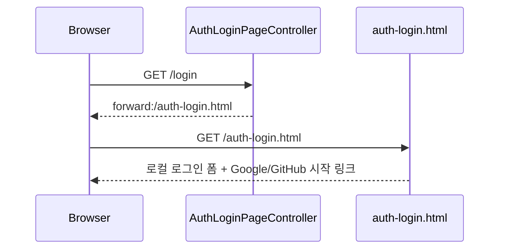
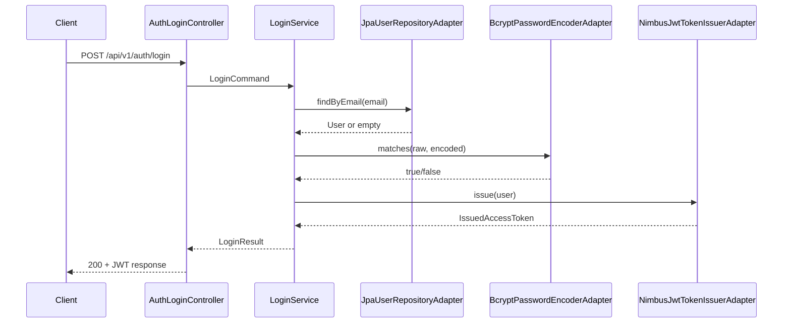
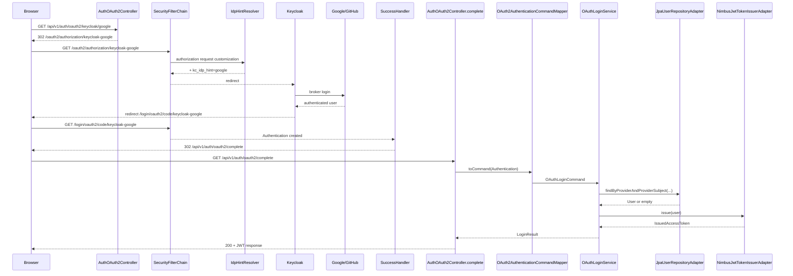

# 인증 흐름 상세

## Why

보안 구조에서 가장 많이 헷갈리는 부분은 "어느 시점까지 Spring Security가 처리하고, 어느 시점부터 우리 코드가 실행되는가"입니다.  
현재 프로젝트는 `/login` 커스텀 페이지, OAuth2 redirect/callback, 세션 유지, `/api/v1/auth/oauth2/complete`, JWT 발급이 연속으로 이어지기 때문에 이 경계를 문서로 명확히 남겨야 합니다.

## What

현재 인증 흐름은 세 갈래로 볼 수 있습니다.

1. 브라우저 로그인 허브 진입
2. 로컬 이메일/비밀번호 로그인
3. Keycloak broker를 통한 OAuth2 소셜 로그인

### 1. 브라우저 로그인 허브



### 2. 로컬 로그인 시퀀스



### 3. OAuth2 로그인 시퀀스



## How

### 1. 브라우저 기본 진입점은 `/login`이다

현재 프로젝트는 `oauth2Login().loginPage("/login")`을 사용합니다.  
즉 브라우저 기준 로그인 진입점은 Spring Security 기본 페이지가 아니라 `/login`입니다.

이 경로는 `AuthLoginPageController`가 `forward:/auth-login.html`로 연결하고, 정적 페이지 `auth-login.html`이 아래를 한 화면에 노출합니다.

- 로컬 로그인 폼
- `GET /api/v1/auth/oauth2/keycloak/google`
- `GET /api/v1/auth/oauth2/keycloak/github`

따라서 이 프로젝트의 실제 브라우저 로그인 흐름은 "Spring Security default login page"가 아니라 "프로젝트 전용 로그인 허브 페이지"에서 시작합니다.

### 2. 로컬 로그인 흐름

로컬 로그인은 Spring Security 인증 provider를 거치지 않습니다.

1. 사용자가 `/api/v1/auth/login`에 이메일과 비밀번호를 보냅니다.
2. `AuthLoginController`가 `LoginCommand`를 만듭니다.
3. `LoginService`가 이메일 형식과 비밀번호 공백 여부를 검증합니다.
4. `JpaUserRepositoryAdapter`가 사용자를 조회합니다.
5. 사용자의 provider가 `LOCAL`이 아니면 즉시 실패합니다.
6. `BcryptPasswordEncoderAdapter.matches()`로 비밀번호를 비교합니다.
7. 성공하면 `NimbusJwtTokenIssuerAdapter`가 access token을 발급합니다.

이 흐름의 핵심은 "비밀번호 로그인 자체는 Spring Security filter chain의 provider 체인이 아니라 명시적 유스케이스"라는 점입니다.

### 3. OAuth2 로그인 시작점

로그인 허브 페이지에서 사용자가 소셜 버튼을 누르면 아래 두 endpoint 중 하나로 들어갑니다.

- `GET /api/v1/auth/oauth2/keycloak/google`
- `GET /api/v1/auth/oauth2/keycloak/github`

이 endpoint는 직접 Keycloak로 보내지 않고 먼저 아래 경로로 redirect합니다.

- `/oauth2/authorization/keycloak-google`
- `/oauth2/authorization/keycloak-github`

즉 presentation controller는 "사용자 친화적인 시작점"만 제공하고, 실제 OAuth2 authorization request 생성은 Spring Security에 위임합니다.

### 4. `kc_idp_hint`가 붙는 시점

`KeycloakIdpHintAuthorizationRequestResolver`는 Spring Security 기본 authorization request resolver를 감싸는 래퍼입니다.

- registration id가 `keycloak-google`이면 `kc_idp_hint=google`
- registration id가 `keycloak-github`이면 `kc_idp_hint=github`

이 값은 Keycloak broker에게 "이번 로그인은 어느 upstream provider로 보낼지"를 알려주는 힌트입니다.

### 5. callback 이후 왜 바로 JWT를 주지 않는가

Spring Security callback이 끝난 뒤 success handler는 곧바로 JSON 응답을 만들지 않고 `/api/v1/auth/oauth2/complete`로 redirect합니다.  
이 구조를 택한 이유는 아래와 같습니다.

- 인증 프로토콜 완료와 비즈니스 후처리를 분리할 수 있습니다.
- controller가 `Authentication`을 명시적으로 받아 `OAuthLoginCommand`로 변환할 수 있습니다.
- OAuth2 로그인 후 사용자 조회/생성과 JWT 발급을 일반 controller + application service 흐름으로 유지할 수 있습니다.

이 구조의 아키텍처 배경은 [01-architecture.md 5.2절](./01-architecture.md#52-상세-설계)에서 더 자세히 다룹니다.

### 6. `/api/v1/auth/oauth2/complete`가 보호 경로인 이유

이 endpoint는 `permitAll` 목록에 없습니다.  
즉 callback이 끝난 뒤 `SecurityContext`에 인증 상태가 살아 있어야만 접근할 수 있습니다.

이 설계는 두 가지를 의미합니다.

- OAuth2 시작 endpoint와 callback endpoint는 공개지만, JWT 발급 마무리 endpoint는 인증 상태가 필요합니다.
- 중간에 세션이 끊기거나 브라우저가 인증 상태를 잃으면 `/complete`에서 실패할 수 있습니다.

이 경로가 보호 경로인 이유는 [01-architecture.md 공개/보호 경로 절](./01-architecture.md#52-상세-설계)에서 `permitAll` 목록과 함께 설명합니다.

### 7. provider는 어떻게 결정되는가

현재 `OAuth2AuthenticationCommandMapper`는 `authorizedClientRegistrationId`를 보고 provider를 추론합니다.

```java
// OAuth2AuthenticationCommandMapper.java — provider 추론 로직
private String resolveProvider(String registrationId) {
    if (registrationId == null || registrationId.isBlank()) {
        throw new InvalidOAuthUserInfoException();
    }
    String normalized = registrationId.trim().toLowerCase(Locale.ROOT);
    if (normalized.contains("google")) {
        return "GOOGLE";
    }
    if (normalized.contains("github")) {
        return "GITHUB";
    }
    throw new UnsupportedOAuthProviderException();
}
```

이 방식은 현재 코드와 도메인 enum(`LOCAL`, `GOOGLE`, `GITHUB`)을 맞추는 데는 충분하지만, registration id naming 규칙에 결합되어 있습니다.  
registration id를 완전히 다른 이름으로 바꾸면 mapper도 함께 수정해야 합니다.

### 8. 세션이 왜 필요한가

현재 보안 설정에는 `SessionCreationPolicy.STATELESS`가 없습니다.  
이는 OAuth2 login이 authorization request와 callback 이후 인증 상태 유지에 기본 세션 모델을 쓰기 때문입니다.

현재 구조에서 세션은 아래 두 지점을 연결합니다.

- `/oauth2/authorization/...`에서 생성된 authorization request
- `/login/oauth2/code/...` 이후 `/api/v1/auth/oauth2/complete`까지 이어지는 인증 상태

즉 "최종 결과는 JWT"이지만, OAuth2 redirect handshake 자체는 stateless하지 않습니다.

## Result

현재 인증 흐름을 한 문장으로 요약하면 아래와 같습니다.

> 브라우저 사용자는 `/login` 허브에서 로그인 방식을 고르고, 로컬 로그인은 application service 유스케이스로 처리하며, OAuth2 로그인만 Spring Security가 세션과 redirect를 활용해 처리한 뒤 최종 JWT 발급은 다시 애플리케이션 서비스로 넘긴다.

이 흐름을 이해하고 있으면 아래 질문에 바로 답할 수 있습니다.

- 왜 `/login`이 실제 로그인 시작점인가?
- 왜 OAuth2 callback 뒤에 controller가 한 번 더 호출되는가?
- 왜 `/api/v1/auth/oauth2/complete`는 공개 endpoint가 아닌가?
- 왜 최종 응답은 JWT인데도 중간에는 세션이 필요한가?
