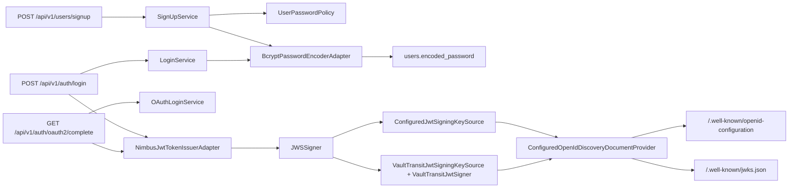

# 토큰, 비밀번호, 공개 키 구조

## Why

인증 서버 설명에서 가장 자주 나오는 질문은 결국 두 가지입니다.

1. 비밀번호는 어떻게 안전하게 저장하고 검증하는가?
2. 발급한 JWT는 어떤 키로 서명하고 외부는 어떻게 검증하는가?

이 문서는 이 두 질문을 현재 코드 기준으로 묶어서 설명합니다.

## What



현재 적용된 핵심 포인트는 아래와 같습니다.

- 비밀번호 저장은 BCrypt입니다.
- access token 서명 알고리즘은 RS256입니다.
- issuer와 key id는 설정값으로 관리합니다.
- 외부 검증자를 위해 JWK Set과 OIDC discovery 문서를 노출합니다.
- 운영 환경에서는 Vault Transit으로 서명을 위임할 수 있습니다.

## How

### 1. 비밀번호 입력 검증은 어디서 이뤄지는가

비밀번호는 한 곳에서만 검증되지 않습니다.

| 단계 | 코드 | 역할 |
|------|------|------|
| HTTP 입력 | `SignUpRequest` | 비어 있지 않은지, 8~50자인지 확인 |
| 애플리케이션 검증 | `SignUpCommandValidator` | DTO를 도메인 값으로 바꾸며 예외 코드 정리 |
| 도메인 정책 | `UserPasswordPolicy.validateRaw()` | 길이/공백 규칙 재검증 |
| 저장 직전 | `BcryptPasswordEncoderAdapter.encode()` | BCrypt 해시 생성 |
| 복원/재사용 | `UserPasswordPolicy.validateEncoded()` | 저장된 인코딩 값이 비어 있지 않은지 확인 |

즉 이 서버는 "입력 validation만으로 보안을 끝내지 않고", 도메인 규칙으로 한 번 더 닫아 둡니다.

### 2. 로컬 로그인에서 비밀번호가 어떻게 비교되는가

`LoginService`는 아래 순서로 비밀번호를 검증합니다.

1. 이메일로 사용자를 조회합니다.
2. 사용자의 `provider`가 `LOCAL`인지 확인합니다.
3. `BcryptPasswordEncoderAdapter.matches(raw, encoded)`를 호출합니다.
4. 하나라도 실패하면 `AUTH-001 INVALID_CREDENTIALS`를 반환합니다.

이 검증 순서 때문에 소셜 계정 이메일로 로컬 로그인을 시도하면 비밀번호가 맞더라도 실패합니다.  
이는 "provider가 다르면 인증 방식도 다르다"는 현재 정책을 의미합니다.

### 3. JWT에는 어떤 정보가 들어가는가

`NimbusJwtTokenIssuerAdapter`가 만드는 JWT claim은 아래와 같습니다.

- `iss`: `app.security.jwt.issuer`
- `sub`: 사용자 UUID
- `iat`: 발급 시각
- `exp`: 만료 시각
- `email`
- `name`
- `provider`

헤더에는 아래 값이 들어갑니다.

- `alg`: `RS256`
- `kid`: `app.security.jwt.active-key-id`
- `typ`: `JWT`

즉 토큰 검증자는 `issuer`, `kid`, `RS256`, 그리고 공개 JWK를 기준으로 검증할 수 있습니다.

### 4. 로컬 RSA 키 경로

`ConfiguredJwtSigningKeySource`는 두 가지 방식으로 동작합니다.

1. 설정된 RSA key set을 읽는다.
2. 키가 없고 `generate-key-pair-on-startup=true`이면 로컬 key pair를 즉석 생성한다.

이 클래스가 중요한 이유는 단순히 개인키를 들고 있기 때문이 아니라, **public JWK set도 함께 만든다**는 점입니다.  
즉 서명과 검증 메타데이터 생성이 한 source에서 정합성을 유지합니다.

또한 key set 전체를 JWK Set으로 구성하기 때문에, active key와 이전 public key를 함께 공개하는 회전 모델도 지원할 수 있습니다.

### 5. Vault Transit 경로

`app.security.jwt.vault.enabled=true`이면 signer 경로가 바뀝니다.

- `VaultTransitJwtSigningKeySource`가 Vault에서 public key metadata를 읽습니다.
- `VaultTransitJwtSigner`가 실제 서명 요청을 `transit/sign/...` API로 위임합니다.
- 애플리케이션은 raw private key를 직접 메모리에 들고 있지 않습니다.

즉 "공개 키는 읽어 오고, 서명은 원격 위임"하는 구조입니다.

이 구조의 장점:

- private key 노출 면적 감소
- 중앙화된 키 관리 가능

이 구조의 비용:

- Vault 네트워크 의존성 증가
- mount path, transit key name, token 오설정 시 즉시 장애 발생

### 6. OIDC discovery는 무엇을 공개하는가

`ConfiguredOpenIdDiscoveryDocumentProvider`는 두 endpoint를 제공합니다.

- `/.well-known/openid-configuration`
- `/.well-known/jwks.json`

공개 문서에는 최소한 아래 정보가 들어갑니다.

- `issuer`
- `jwks_uri`
- `id_token_signing_alg_values_supported = ["RS256"]`
- `subject_types_supported = ["public"]`

`jwks.json`에는 public key만 들어가며 private key(`d`)는 포함되지 않습니다.  
이건 누락이 아니라 정상 동작입니다. 외부 검증자는 public key만 알면 되기 때문입니다.

### 7. 운영에서 꼭 맞춰야 하는 설정

| 설정 | 왜 중요한가 |
|------|-------------|
| `APP_SECURITY_JWT_ISSUER` | 토큰 `iss`와 discovery 문서의 `issuer`가 됩니다. 외부 검증자와 반드시 일치해야 합니다. |
| `APP_SECURITY_JWT_ACTIVE_KEY_ID` | JWT 헤더 `kid`와 JWK `kid`를 맞춥니다. |
| `APP_SECURITY_JWT_ACCESS_TOKEN_EXPIRATION` | access token TTL을 결정합니다. |
| `APP_SECURITY_JWT_GENERATE_KEY_PAIR_ON_STARTUP` | 로컬에서 임시 키를 허용할지 결정합니다. |
| `APP_SECURITY_JWT_VAULT_*` | Vault 서명 위임 경로를 결정합니다. |

아래는 `application-local.yml`에서 실제로 이 설정이 어떻게 구성되는지 보여줍니다.

```yaml
# bootstrap/src/main/resources/application-local.yml — JWT 관련 설정
app:
  security:
    jwt:
      issuer: ${APP_SECURITY_JWT_ISSUER:http://localhost:8080}
      active-key-id: ${APP_SECURITY_JWT_ACTIVE_KEY_ID:local-generated-rsa-1}
      generate-key-pair-on-startup: ${APP_SECURITY_JWT_GENERATE_KEY_PAIR_ON_STARTUP:true}
      access-token-expiration: ${APP_SECURITY_JWT_ACCESS_TOKEN_EXPIRATION:PT30M}
      vault:
        enabled: ${APP_SECURITY_JWT_VAULT_ENABLED:false}
        address: ${APP_SECURITY_JWT_VAULT_ADDRESS:http://localhost:8200}
        token: ${APP_SECURITY_JWT_VAULT_TOKEN:project-auth-root-token}
        mount-path: ${APP_SECURITY_JWT_VAULT_MOUNT_PATH:transit}
        transit-key-name: ${APP_SECURITY_JWT_VAULT_TRANSIT_KEY_NAME:project-auth-jwt}
```

위 설정에서 `generate-key-pair-on-startup: true`는 로컬 개발 전용입니다. 운영 환경에서는 반드시 `false`로 두고 고정 키 또는 Vault를 사용해야 합니다.

## Result

현재 구조의 결론은 명확합니다.

- 비밀번호 보호는 DTO validation, 도메인 정책, BCrypt가 함께 맡습니다.
- JWT 발급은 애플리케이션이 하지만, 키 material과 signer는 교체 가능한 별도 구성으로 분리돼 있습니다.
- 이 서버는 access token만 발급하는 것이 아니라, 그 토큰을 검증하기 위한 공개 메타데이터도 함께 제공합니다.

따라서 "이 서버는 인증 서버인가요, 아니면 단순 로그인 API인가요?"라는 질문에는 아래처럼 답할 수 있습니다.

> 현재 프로젝트는 full authorization server는 아니지만, 자체 JWT 발급과 OIDC discovery/JWK 공개까지 포함한 인증 서버의 일부 역할을 수행한다.
