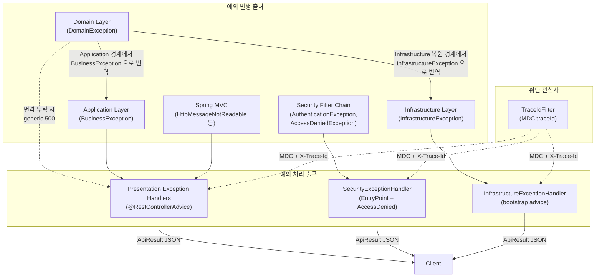
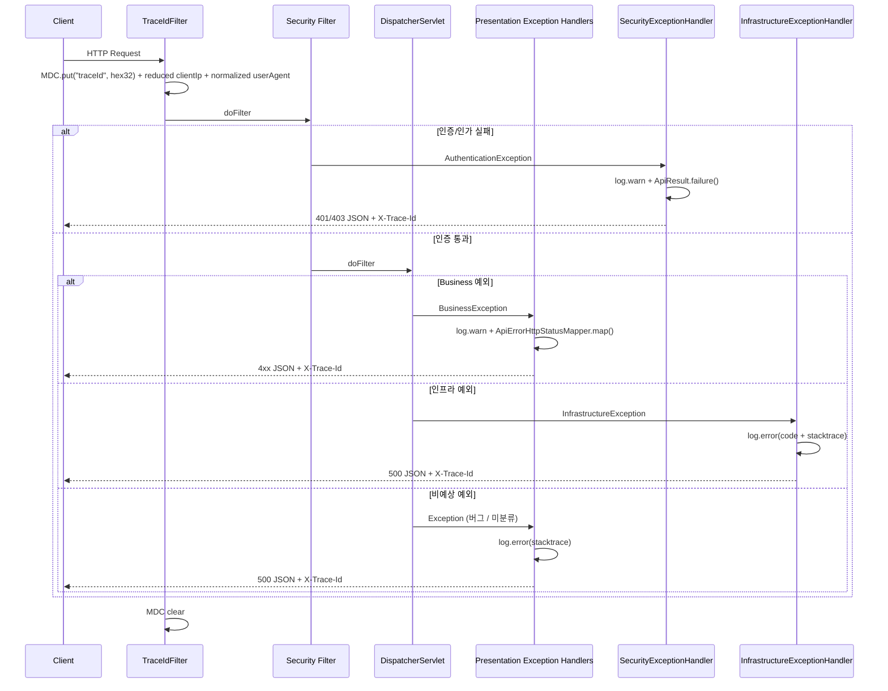

# 에러 핸들링 아키텍처

> **정책 단일 출처**: 코드/테스트/게이트로 강제되는 13개 정책의 *현재 상태*는
> [`docs/exception-handling-policy.md`](../../exception-handling-policy.md) 가 정식 정의입니다.
> 본 문서는 그 정책이 어떤 *문제 의식과 흐름*에서 왔는지를 설명하는 아키텍처 문서입니다.
> 두 문서가 어긋나면 정책 문서가 우선합니다.

## 1. Context & Scope

### 목적

이 문서는 Project-Auth-Server 의 예외 처리 구조를 설명합니다. 핵심 질문은 *"예외가 어디서 발생하든, 사용자에게 보이는 응답 계약과 내부 책임 경계가 왜 흔들리면 안 되고, 어떻게 흔들리지 않는 상태를 유지하는가"* 입니다.

### Scope

- 포함: 예외 계층 구조, 계층별 예외 처리 책임, Security 필터 예외 처리, 로깅 전략
- 제외:
  - 인증 / 인가 비즈니스 플로우 → [03-keycloak/](../03-keycloak/)
  - Validation 처리 / `ConstraintViolation` / `@ConfigurationProperties` 검증 → [02a-validation-deep-dive.md](./02a-validation-deep-dive.md)
  - traceId / MDC / structured logging → [04-logging/01-architecture.md](../04-logging/01-architecture.md)

## 2. Why

### 해결하려는 문제

리뷰 시점에서 에러 핸들링에 다음 6 가지 구조적 결함이 있었습니다.

| # | 문제 | 심각도 | 영향 |
|---|------|--------|------|
| 1 | 프로젝트 전체에 Logger 가 0 건 | HIGH | 500 에러 발생 시 원인 추적 불가. 프로덕션 장애 시 블라인드 |
| 2 | Security 필터 예외가 JSON 이 아닌 Spring 기본 페이지로 응답됨 | HIGH | 인증 / 인가 실패 시 클라이언트가 파싱할 수 없는 응답을 받음 |
| 3 | Spring 기본 예외 (malformed JSON, 잘못된 HTTP 메서드 등) 미처리 | MEDIUM | 클라이언트 잘못인데 500 (서버 오류) 으로 응답됨 |
| 4 | 인프라에서 `IllegalStateException` 직접 throw | MEDIUM | 예외 계층 원칙 위반. 기술 예외가 비즈니스 예외로 번역되지 않음 |
| 5 | `DomainException` 누수 방지 규칙 없음 | MEDIUM | presentation 이 도메인 메시지를 직접 외부 응답으로 노출할 수 있음 |
| 6 | 응답에 `timestamp` 가 없고 요청 추적 수단이 없음 | LOW | 운영 디버깅 시 시점 특정과 로그 검색 어려움 |

### 왜 이 구조를 선택했는가

핵심 설계 판단은 *"모든 예외의 최종 출구를 하나의 JSON 계약으로 통일하되, 각 계층의 책임은 분리한다"* 입니다.

선택 근거:
1. REST API 서버에서 클라이언트는 모든 응답을 동일한 파서로 처리해야 합니다. Security 필터 예외만 HTML 로 내려가면 클라이언트에 분기 로직이 필요해집니다.
2. 예외의 발생 위치 (도메인, 인프라, Security 필터) 는 다르지만, 응답 형태는 같아야 합니다. 이를 위해 `ApiResult` 를 모든 출구에서 공유합니다.
3. 예상 가능한 예외 (비즈니스 로직) 와 예상하지 못한 예외 (인프라 장애) 는 로그 레벨을 분리해야 운영 시 알림 설정이 가능합니다.

## 3. Goals & Non-Goals

### Goals

- 예외 발생 위치와 무관하게 `ApiResult` JSON 응답 계약을 보장한다 — `data` 와 `errors` 를 분리하여 OpenAPI 가 `data` 를 oneOf 로 모델링할 필요 없게 한다
- 예상 예외 (4xx) 와 비예상 예외 (5xx) 의 로깅 정책을 분리한다
- 요청별 `traceId` 로 로그와 응답을 연결할 수 있게 한다 — MDC 누락 시 sentinel `"-"` 노출
- 내부 분류 코드 (`InfrastructureErrorCode`) 가 클라이언트 응답 경로에 *컴파일 단계에서* 닿지 못하게 한다
- 새 client-facing ErrorCode 추가 시 매퍼/테이블 누락을 *classpath 스캔 가드 테스트* 로 즉시 검출한다
- 익명 사용자의 `AccessDenied` 는 401, 인증된 사용자만 403 (SDK 토큰 재발급 흐름 보존)
- advice 우회 경로(`sendError`, 이중 폴트, 컨테이너 라우팅 실패) 는 `/error` 가 안전망으로 받되 *원래 status 를 보존* 한다 — 404 가 500 으로 둔갑하지 않게
- 정책 회귀를 JaCoCo Tier 1 95%+ / PIT mutation 게이트 / jqwik 속성 테스트로 자동 차단한다

### Non-Goals

- RFC 7807 (Problem Details) 표준 도입 — 현재 `ApiResult` 계약이 충분히 일관적이므로 이관 비용 대비 이점이 낮음
- 분산 추적 (Distributed Tracing) — 현재 단일 서비스이므로 MDC 기반 UUID 로 충분
- i18n MessageSource 도입 — `ClientFacingErrorCode.message()` 는 한국어 하드코딩이며, 별도 사건으로 미룸

## 4. Architecture Overview

### 4.1 전체 구조



### 4.2 핵심 컴포넌트

#### 예외 계층 구조

```
RuntimeException
├── DomainException (domain 모듈)
│   ├── InvalidUserEmailException
│   └── InvalidUserNameException
├── BusinessException (application 모듈, ErrorCode 보유)
│   ├── KeycloakUserNotFoundException (AUTH-004)
│   ├── InvalidKeycloakClaimsException (AUTH-003)
│   └── ...
└── InfrastructureException (infrastructure 모듈, InfrastructureErrorCode 보유)
    ├── PERSISTED_DATA_INVALID (INFRA-003) — 저장 데이터가 도메인 규칙에 맞지 않음
    └── EXTERNAL_SERVICE_ERROR (INFRA-999) — 외부 시스템 연동 오류
```

- **DomainException**: 도메인 불변식 위반. ErrorCode 를 가지지 않음. 순수 도메인 규칙 표현용. `cause` 체이닝을 지원하여 원본 예외 스택 트레이스를 보존할 수 있음. 현재 정책은 이 타입이 presentation 까지 도달하지 않도록 application / infrastructure 경계에서 번역하는 것. 누수되면 generic 500 으로 처리하며, 도메인 메시지를 외부 응답에 직접 노출하지 않는다.
- **BusinessException**: 비즈니스 유스케이스 예외. `ErrorCode` (code + message) 를 반드시 보유. HTTP status 매핑의 기준점. `cause` 체이닝을 지원하여 도메인 예외 변환 시 원본 스택 트레이스를 보존할 수 있음.
- **InfrastructureException**: 기술 구현체의 장애. `InfrastructureErrorCode` (INFRA- 접두사) 를 보유하여 인프라 장애 유형을 구분. bootstrap 의 `InfrastructureExceptionHandler` 에서 전용 처리되며, 상세 메시지와 인프라 코드는 로그에만 기록하고 사용자에게는 `COMMON-999` 만 응답.

#### 예외-응답 매핑 흐름 (sealed 분리)

```
ErrorCode  (sealed)
  permits ClientFacingErrorCode, ExternalErrorCode

  ClientFacingErrorCode  (non-sealed marker)         ExternalErrorCode  (non-sealed marker)
    ├── CommonErrorCode   → mapCommon()                ├── InfrastructureErrorCode  (내부 분류 전용)
    ├── AuthErrorCode     → mapAuth()                  └── (다른 인프라 모듈도 여기에 추가)
    └── PresentationErrorCode → mapPresentation()
```

##### 매퍼 시그니처 좁히기 — 정책을 *컴파일 단계에서* 강제

```java
public static HttpStatus map(ClientFacingErrorCode errorCode) { ... }
```

매퍼는 `ErrorCode` 가 아니라 `ClientFacingErrorCode` 만 받습니다. 그래서:

- `InfrastructureErrorCode` 를 매퍼에 인자로 넣는 모든 코드는 **`javac` 단계에서 컴파일 실패** 합니다.
- `BusinessException.errorCode` 필드 타입도 `ClientFacingErrorCode` 로 좁혀, `BusinessException` 을 잘못된 코드로 *생성하는 것 자체* 가 불가능합니다.

이 정책의 의도는 두 가지를 코드 한 줄로 동시에 표현하는 것입니다.

- 내부 분류 코드 (`INFRA-003`, `INFRA-999` 등) 는 로그·모니터링·알람 라우팅용으로 *유지* 한다.
- 동시에 클라이언트 응답 경로에는 *닿을 수 없다* — 우회로가 없다.

##### `ClientFacingErrorCode` 가 *non-sealed* 인 이유

다른 모듈에서 클라이언트 노출 코드를 추가할 수 있어야 하므로 `ClientFacingErrorCode` 자체는 `non-sealed` 입니다. 그러면 매퍼의 switch 가 비-exhaustive 가 되므로 다음 두 단계로 회귀를 막습니다.

1. `ApiErrorHttpStatusMapper.map(...)` 의 `default` 분기는 `WARN` 로그를 남기고 500 으로 폴백합니다 — 사일런트 500 방지.
2. `ApiErrorHttpStatusMapperClientFacingCoverageTest` 가 *classpath 스캔* 으로 모든 `ClientFacingErrorCode` 구현을 찾아 매핑 테이블에 빠진 값이 있으면 테스트 실패시킵니다 — 신규 코드 누락 방지.

추가로 같은 테스트가 enum 값별 정확 status 매핑 (`each_client_facing_error_code_maps_to_its_exact_expected_http_status`) 과 코드 문자열 유일성 (`all_client_facing_error_codes_have_unique_string_codes`) 을 함께 단언합니다.

##### `InfrastructureErrorCode` 의 운영 가치는 그대로

매퍼에서 차단된다고 해서 `InfrastructureErrorCode` 가 무용한 것은 아닙니다.

- 로그에서 `INFRA-003`, `INFRA-999` 를 보고 운영자가 원인을 좁힙니다.
- 알람 라우팅·대시보드·on-call 분기 모두 이 코드 기준입니다.
- 클라이언트는 구현 세부사항이 제거된 `COMMON-999` 만 받습니다.

즉 같은 사건에 대해 *내부 분류* 와 *외부 노출* 을 분리해서 관리합니다.

## 5. How It Works

### 5.1 예외 처리 흐름



### 5.2 단계별 설계

#### 단계 1: 요청 추적 (TraceIdFilter)

모든 요청에 대해 Security 필터보다 먼저 실행됩니다. 자세한 동작과 운영 점검은 [04-logging/01-architecture.md](../04-logging/01-architecture.md) 참고.

핵심만:
- `Ordered.HIGHEST_PRECEDENCE` 로 등록되어 Spring Security 안쪽 로그에도 traceId 가 남는다
- 응답 헤더 `X-Trace-Id` 를 설정해 클라이언트 / CS 팀 / 개발자 경로 연결 가능

#### 단계 2: Security 예외 처리 (SecurityExceptionHandler)

Spring Security 예외는 `DispatcherServlet` 도달 전에 필터 체인에서 발생하기 때문에 `@RestControllerAdvice` 가 잡을 수 없습니다.

**이것이 `SecurityExceptionHandler` 를 별도로 둔 이유입니다.**

```java
// SecurityExceptionHandler — AuthenticationEntryPoint + AccessDeniedHandler 동시 구현
public class SecurityExceptionHandler implements AuthenticationEntryPoint, AccessDeniedHandler {

    @Override
    public void commence(..., AuthenticationException authException) throws IOException {
        log.warn("Authentication required. actorId={} method={} requestPath={}", ...);
        writeErrorResponse(response, HttpStatus.UNAUTHORIZED, AuthErrorCode.AUTHENTICATION_REQUIRED);
    }

    @Override
    public void handle(..., AccessDeniedException accessDeniedException) throws IOException {
        log.warn("Access denied. actorId={} method={} requestPath={}", ...);
        writeErrorResponse(response, HttpStatus.FORBIDDEN, AuthErrorCode.ACCESS_DENIED);
    }
}
```

운영 로그에서 바로 도움이 되도록 다음 정보를 함께 남깁니다.

- `traceId`: 응답 바디 / 헤더와 로그를 연결
- `actorId`: 인증된 사용자가 있으면 원문 대신 마스킹 / 해시된 값으로 기록
- `HTTP method + requestPath`: 어떤 요청에서 거부되었는지 확인

`ResourceServerSecurityConfiguration` 에서 연결합니다:

```java
.oauth2ResourceServer(oauth2 -> oauth2
        .jwt(jwt -> jwt.jwtAuthenticationConverter(jwtAuthenticationConverter))
        .authenticationEntryPoint(securityExceptionHandler)
        .accessDeniedHandler(securityExceptionHandler))
.exceptionHandling(exceptions -> exceptions
        .authenticationEntryPoint(securityExceptionHandler)
        .accessDeniedHandler(securityExceptionHandler))
```

#### 단계 3: Presentation 예외 처리 (5 + 1 계층)

초기에는 `GlobalExceptionHandler` 하나에 모든 예외가 모여 있었지만, 발생 *위치별* 로 책임을 분리하면서 현재는 **5계층 advice + 2개의 advice-밖 안전망 (= 5 + 1)** 으로 운영합니다.

```text
          @Order                    위치           책임
─────────────────────────────────────────────────────────────────────────────
HIGHEST_PRECEDENCE        bootstrap   InfrastructureExceptionHandler
                                       Infra/Domain 누수 → COMMON-999 정규화
HIGHEST_PRECEDENCE + 5    bootstrap   SecurityResponseExceptionHandler
                                       AuthenticationException / AccessDeniedException
                                       익명 → 401 · 인증 → 403 + audit
HIGHEST_PRECEDENCE + 10   presentation  ValidationExceptionHandler
                                       Bean Validation (Method/Constraint/HandlerMethod)
                                       → errors 맵 (JSON Pointer 키, RFC 6901)
HIGHEST_PRECEDENCE + 20   presentation  RequestExceptionHandler
                                       Spring MVC 입력 11 종 + ResponseStatus / Upload
LOWEST_PRECEDENCE         presentation  ApplicationExceptionHandler
                                       BusinessException + MessageNotWritable
                                       + @ExceptionHandler(Exception.class)  ← 안전망

(advice 밖)               bootstrap   SecurityExceptionHandler
                                       필터 단 AuthenticationEntryPoint /
                                       AccessDeniedHandler — advice 가 못 보는 경로
                                       audit + response.isCommitted() 체크

(/error 매핑)             bootstrap   ApiErrorController
                                       advice 우회 (sendError, 이중 폴트, 컨테이너 라우팅 실패)
                                       — 컨테이너가 결정한 status 그대로 보존
                                       — 본문만 ApiResult 로 정규화
```

##### 왜 `SecurityResponseExceptionHandler` 가 bootstrap 에 있는가

ArchUnit 규칙(`presentation_must_not_read_security_context_directly`, `presentation_must_not_accept_raw_spring_security_authentication`) 이 presentation 모듈의 `org.springframework.security.core.*` 직접 의존을 막습니다. 익명/인증 분기는 `SecurityContextHolder` + `Authentication` 을 보아야 하므로, 이 advice 는 bootstrap 에 둡니다 — 룰 우회 없이 정직하게 분리.

##### `SecurityResponseExceptionHandler` 의 익명/인증 분기 정책

```java
@ExceptionHandler(AccessDeniedException.class)
public ResponseEntity<ApiResult<Void>> handle(AccessDeniedException ex, HttpServletRequest req) {
    if (isAnonymous(SecurityContextHolder.getContext().getAuthentication(), req)) {
        // 익명 → 401, 클라이언트 SDK 의 토큰 재발급 트리거 유지
        return failure(AUTHENTICATION_REQUIRED, ...);
    }
    // 인증된 사용자 → 403, 권한 부족 의미
    return failure(ACCESS_DENIED, ...);
}

private static boolean isAnonymous(Authentication auth, HttpServletRequest req) {
    if (req.getUserPrincipal() != null) return false; // 비동기 컨텍스트 유실 방어
    return auth == null || !auth.isAuthenticated() || auth instanceof AnonymousAuthenticationToken;
}
```

이전에는 모든 `AccessDeniedException` 을 403 으로 응답했는데, 익명 사용자에게도 403 을 주면 SDK 가 토큰 재발급 흐름을 트리거하지 못합니다. `ExceptionTranslationFilter` 가 필터 단에서 하던 분기 (익명 → 401) 를 컨트롤러 단(`@PreAuthorize` 등) 에도 동일하게 적용한 것입니다. `getUserPrincipal()` 폴백은 비동기 컨트롤러로 SecurityContext 가 워커 스레드에 전파되지 않은 케이스를 방어합니다.

##### `ApiErrorController` 의 status 보존 정책

이전에는 `/error` 가 무조건 500 을 반환해 진짜 404 가 500 으로 둔갑하면서 LB 헬스체크 오작동·SDK 5xx 자동 재시도 폭주가 발생했습니다. 현재는 `RequestDispatcher.ERROR_STATUS_CODE` 를 그대로 보존하고, 5xx 만 `COMMON-999` 로 정규화, 4xx 는 `RESOURCE_NOT_FOUND` / `METHOD_NOT_ALLOWED` / `UNHANDLED_CLIENT_ERROR` 등으로 분류합니다.

##### `Exception.class` 안전망

`ApplicationExceptionHandler` 의 `@ExceptionHandler(Exception.class)` 가 advice 안의 마지막 안전망입니다. 매칭되지 않은 모든 `RuntimeException` 을 잡아 ERROR 레벨 풀스택 로깅 + `COMMON-999` 응답으로 정규화합니다. 안전망이 없으면 unmatched 예외가 `/error` 로 흘러가 `ApiResult` 계약이 깨질 수 있습니다.

##### 로깅 정책이 분리되는 지점

- 예상 예외 (비즈니스 / 도메인 / 클라이언트 잘못) → `log.warn` — 알림 불필요
- 비예상 예외 (인프라 장애, 버그) → `log.error` — 즉시 알림 대상
- 모든 핸들러 로그가 `method=`, `requestPath=`, `errorCode=` 필드를 일관되게 포함 (정책 11)

> Validation 예외 응답 정규화, `ConstraintViolation` / `MessageSourceResolvable` 의미, `@ConfigurationProperties` 검증과의 차이는 [02a-validation-deep-dive.md](./02a-validation-deep-dive.md) 에서 따로 다룹니다.

#### 단계 4: 인프라 예외 번역

인프라 계층에서는 기술 예외를 `InfrastructureException` 으로 감싸서 던집니다. `JpaUserRepositoryAdapter` 가 저장된 row 를 도메인으로 복원할 때의 패턴이 대표 예시입니다.

```java
// Before — 예외 계층 원칙 위반
try {
    return User.restoreFromRow(row);
} catch (DomainException | IllegalArgumentException | NullPointerException exception) {
    throw new IllegalStateException("Invalid persisted user row.", exception);
}

// After — 전용 예외 타입 + ErrorCode 로 번역
try {
    return User.restoreFromRow(row);
} catch (DomainException | IllegalArgumentException | NullPointerException exception) {
    throw new InfrastructureException(
            InfrastructureErrorCode.PERSISTED_DATA_INVALID,
            "Failed to restore User from persisted row.",
            exception);
}
```

`InfrastructureException` 은 `InfrastructureErrorCode` 를 보유합니다:

| 코드 | 의미 |
|------|------|
| `INFRA-003` | 저장된 데이터가 도메인 규칙에 맞지 않습니다 (`PERSISTED_DATA_INVALID`) |
| `INFRA-999` | 외부 시스템 연동 중 오류가 발생했습니다 (`EXTERNAL_SERVICE_ERROR`) |

bootstrap 의 `InfrastructureExceptionHandler` (`@Order(HIGHEST_PRECEDENCE)`) 가 이를 전용 처리합니다:
- `log.error` 로 에러 코드, 상세 메시지, 스택트레이스를 기록
- 사용자에게는 항상 `COMMON-999` 와 그 메시지만 응답, 내부 기술 정보 노출 차단
- presentation 이 infrastructure 에 의존하지 않도록 핸들러를 bootstrap 에 배치 (레이어 규칙 준수)
- 즉 bootstrap 은 단순 조립만 하는 모듈이 아니라, presentation 이 직접 의존할 수 없는 기술 예외를 HTTP 경계에서 번역하는 소수의 adapter 도 포함합니다.
- persistence adapter 는 저장소에서 읽은 데이터를 domain 으로 복원할 때 `DomainException`, `IllegalArgumentException`, `NullPointerException` 을 `InfrastructureException(INFRA-003)` 로 번역. 잘못된 저장 데이터는 비즈니스 검증 실패가 아니라 인프라 무결성 문제로 간주.

## 6. Alternatives Considered

### 대안 1: `@RestControllerAdvice` 에서 Security 예외까지 한 곳에서 처리

- 장점: 예외 핸들러가 한 파일에 모여 관리 편의성이 높아짐.
- 단점: Security 예외는 `DispatcherServlet` 이전에 발생하므로 `@RestControllerAdvice` 가 도달하지 못함. `HandlerExceptionResolver` 를 위임하는 패턴이 있지만, 필터 체인과 서블릿 컨텍스트 사이의 경계를 인위적으로 넘겨야 하므로 복잡도가 올라감.
- 왜 선택하지 않았는가: Spring Security 의 설계 의도에 맞게 `AuthenticationEntryPoint` / `AccessDeniedHandler` 를 분리하는 것이 유지보수와 프레임워크 호환성 측면에서 더 안정적.

### 대안 2: RFC 7807 Problem Details 표준 도입

- 장점: 업계 표준 (`application/problem+json`), Spring 6 의 `ProblemDetail` 네이티브 지원.
- 단점: 기존 `ApiResult` 계약을 전면 교체해야 하고, 이미 클라이언트와 맞춘 응답 구조를 깨뜨림.
- 왜 선택하지 않았는가: 현재 `ApiResult` 가 `success`, `code`, `message`, `data`, `timestamp` 필드로 충분히 일관적이며, RFC 7807 이관 비용이 이점보다 큼. 추후 API 버전업 시 고려 가능.

### 대안 3: Micrometer Tracing 으로 분산 추적

- 장점: OpenTelemetry 호환, Zipkin / Jaeger 연동, span 기반 성능 분석.
- 단점: 현재 단일 서비스이므로 오버엔지니어링. 의존성과 설정 복잡도가 급증.
- 왜 선택하지 않았는가: MDC 기반 UUID 필터가 현재 규모에 적합. 향후 MSA 전환 시 `TraceIdFilter` 를 Micrometer 로 교체하면 됨.

## 7. Cross-cutting Concerns

- **로깅**: SLF4J + MDC. 예상 예외 `warn`, 비예상 예외 `error`. `logback-spring.xml` 의 패턴이 `%X{traceId}` 를 출력. 자세히는 [04-logging/01-architecture.md](../04-logging/01-architecture.md).
- **보안**: 비예상 예외 발생 시 내부 기술 정보가 응답에 노출되지 않도록 고정 메시지 (`COMMON-999`) 사용. 내부 정보는 로그에만 기록.
- **테스트**: `ApiErrorHttpStatusMapper` 의 client-facing coverage 테스트가 새 ErrorCode 추가 시 기본 500 폴백 누락을 탐지. `ExceptionHandlingIntegrationTest` 가 `401/403/400/405/500` 실제 웹 흐름을 고정.
- **운영**: 응답 헤더 `X-Trace-Id` 를 통해 클라이언트 → CS팀 → 개발자 경로로 장애 원인 특정 가능. `log.error` 기반으로 알림 시스템과 연동 가능.

## 8. Result / Trade-offs

### 얻은 이점

- 예외 발생 위치 (도메인, 인프라, Security 필터/컨트롤러, Spring MVC) 와 무관하게 `ApiResult` JSON 응답 보장
- 내부 분류 코드 (`InfrastructureErrorCode`) 의 클라이언트 응답 경로 진입을 *컴파일 단계에서 차단* — 런타임 검사 X
- 익명 사용자 401 분기로 클라이언트 SDK 의 토큰 재발급 흐름 보존
- `/error` 안전망이 컨테이너 status 를 보존 — 진짜 404 가 500 으로 둔갑해 LB/SDK 정책이 깨지는 사고 차단
- `ApiResult` 의 `data` / `errors` 분리로 OpenAPI 가 응답을 oneOf 로 모델링할 필요 없음
- 예상 / 비예상 예외의 로깅 레벨 분리로 운영 알림 설정 가능
- 요청별 `traceId` 로 로그-응답 연결 (응답 헤더 `X-Trace-Id` + 응답 바디 `traceId` 필드, MDC 누락 시 sentinel `"-"`)
- 새 `ClientFacingErrorCode` 구현 추가 시 *classpath 스캔 가드 테스트* 가 매핑 테이블 누락을 즉시 검출
- 정확값 매핑 테이블 + PIT mutation 게이트 (application 90%, presentation 75%) + jqwik 30+ 속성 테스트로 단언 강도 자동 검증
- 검증 실패 응답 키를 *JSON Pointer (RFC 6901)* 로 통일 — 클라이언트가 두 가지 키 형식을 분기 처리할 필요 없음
- `DomainException` 이 웹 계층까지 직접 올라오는 경로를 제거하여, presentation 이 순수 HTTP 번역 책임에만 집중할 수 있음
- 5 advice + 2 안전망 책임 분리로 핸들러 확장 시 유지보수 부담을 줄임

### 감수한 비용

- `ApiResult` 에 `errors`, `traceId`, `timestamp` 필드가 추가되어 기존 응답 계약이 변경됨 (총 7 필드)
- Security 예외 핸들링이 *세 곳* 에 분산: (1) 필터 단 `SecurityExceptionHandler`, (2) 컨트롤러 단 `SecurityResponseExceptionHandler`, (3) `/error` 안전망 `ApiErrorController`. 대신 `SecurityAuditTrailWriter` 단일 채널로 audit 만은 한 곳에서 받게 통일.
- `InfrastructureExceptionHandler` / `SecurityResponseExceptionHandler` / `ApiErrorController` 가 bootstrap 에 있어서 예외 처리 코드가 presentation 과 bootstrap 두 모듈에 분산됨 (레이어 규칙 준수를 위한 트레이드오프)
- 저장 데이터 복원 실패를 `INFRA-003` 으로 분류하면서, 일부 데이터 불일치가 곧바로 500 으로 처리됨
- `ClientFacingErrorCode` 가 `non-sealed` 라 매퍼에 `default` 분기가 필요. 컴파일러가 exhaustiveness 를 강제하지 못하므로 *classpath 스캔 가드 테스트* + WARN 로그 두 가지로 보완

### 남은 리스크

- `TraceIdFilter` 가 심는 MDC 키와 `logback-spring.xml` 패턴이 어긋나면 traceId 상관관계가 끊길 수 있음
- 익명/인증 분기는 ThreadLocal `SecurityContextHolder` 를 가정. 비동기 컨트롤러 도입 시 `getUserPrincipal()` 폴백만으로 충분한지는 도입 시점에 재검증 필요
- `ClientFacingErrorCode.message()` 는 한국어 하드코딩 — i18n MessageSource 도입은 별도 사건으로 미룸
- `DomainException` 이 누수되면 원본 메시지 대신 generic 500 으로 처리되므로, application / infrastructure 경계 번역 누락은 테스트로 계속 감시해야 함

## 9. References

### 관련 코드

- 예외 계층 기반: [DomainException.java](../../../domain/src/main/java/com/project/auth/domain/user/exception/DomainException.java), [BusinessException.java](../../../application/src/main/java/com/project/auth/application/support/exception/BusinessException.java), [InfrastructureException.java](../../../infrastructure/src/main/java/com/project/auth/infrastructure/support/exception/InfrastructureException.java)
- 에러 코드 (sealed 분리): [ErrorCode.java](../../../application/src/main/java/com/project/auth/application/support/exception/ErrorCode.java), [ClientFacingErrorCode.java](../../../application/src/main/java/com/project/auth/application/support/exception/ClientFacingErrorCode.java), [ExternalErrorCode.java](../../../application/src/main/java/com/project/auth/application/support/exception/ExternalErrorCode.java), [CommonErrorCode.java](../../../application/src/main/java/com/project/auth/application/support/exception/CommonErrorCode.java), [AuthErrorCode.java](../../../application/src/main/java/com/project/auth/application/support/exception/AuthErrorCode.java), [PresentationErrorCode.java](../../../presentation/src/main/java/com/project/auth/presentation/support/exception/PresentationErrorCode.java), [InfrastructureErrorCode.java](../../../infrastructure/src/main/java/com/project/auth/infrastructure/support/exception/InfrastructureErrorCode.java)
- 예외 핸들러 (5 advice): [ValidationExceptionHandler.java](../../../presentation/src/main/java/com/project/auth/presentation/support/exception/ValidationExceptionHandler.java), [RequestExceptionHandler.java](../../../presentation/src/main/java/com/project/auth/presentation/support/exception/RequestExceptionHandler.java), [ApplicationExceptionHandler.java](../../../presentation/src/main/java/com/project/auth/presentation/support/exception/ApplicationExceptionHandler.java), [InfrastructureExceptionHandler.java](../../../bootstrap/src/main/java/com/project/auth/config/web/InfrastructureExceptionHandler.java), [SecurityResponseExceptionHandler.java](../../../bootstrap/src/main/java/com/project/auth/config/web/SecurityResponseExceptionHandler.java)
- advice 밖 안전망: [SecurityExceptionHandler.java](../../../bootstrap/src/main/java/com/project/auth/config/auth/security/SecurityExceptionHandler.java) (필터 단), [ApiErrorController.java](../../../bootstrap/src/main/java/com/project/auth/config/web/ApiErrorController.java) (`/error` 매핑)
- 응답: [ApiResult.java](../../../presentation/src/main/java/com/project/auth/presentation/support/response/ApiResult.java) (7 필드 + `@JsonInclude(NON_NULL)`), [ApiErrorHttpStatusMapper.java](../../../presentation/src/main/java/com/project/auth/presentation/support/exception/ApiErrorHttpStatusMapper.java) (시그니처 좁히기)
- 테스트: [ApiErrorHttpStatusMapperClientFacingCoverageTest.java](../../../bootstrap/src/test/java/com/project/auth/architecture/ApiErrorHttpStatusMapperClientFacingCoverageTest.java) (정확값 + classpath 가드), [ExceptionHandlingIntegrationTest.java](../../../bootstrap/src/test/java/com/project/auth/ExceptionHandlingIntegrationTest.java), [ApiErrorControllerIntegrationTest.java](../../../bootstrap/src/test/java/com/project/auth/ApiErrorControllerIntegrationTest.java), [ValidationExceptionHandlerIntegrationTest.java](../../../bootstrap/src/test/java/com/project/auth/ValidationExceptionHandlerIntegrationTest.java)

### 관련 문서

- [exception-handling-policy.md](../../exception-handling-policy.md) — 13개 정책 단일 출처 (정식 정의)
- [testing-coverage-policy.md](../../testing-coverage-policy.md) — JaCoCo / PIT / jqwik Tier 분류와 임계치
- [testing-history/](../../testing-history/README.md) — 사건 단위 before/after 비교 기록
- [Architecture Overview](../../architecture/README.md) — 레이어 구조와 의존 방향
- [03-adr-boundary-refactoring.md](./03-adr-boundary-refactoring.md) — 경계 재정렬 결정 기록
- [02a-validation-deep-dive.md](./02a-validation-deep-dive.md) — Validation 예외 응답 정규화, ConstraintViolation 의미, ConfigurationProperties 검증
- [04-logging/01-architecture.md](../04-logging/01-architecture.md) — TraceIdFilter, MDC, structured logging
