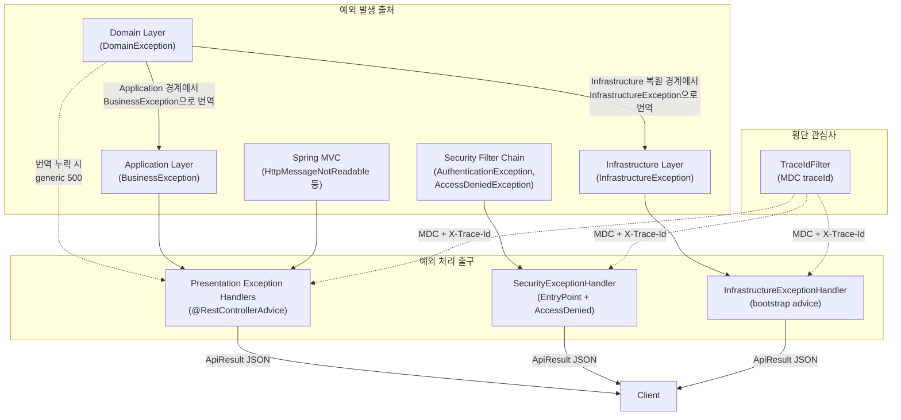
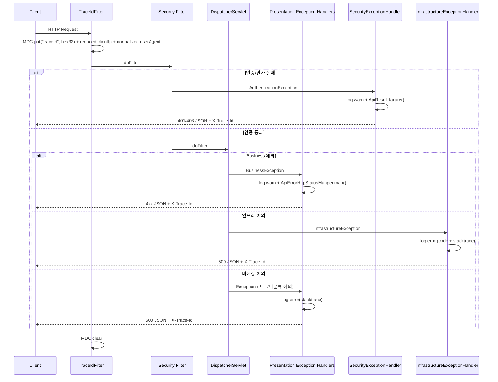

# 에러 핸들링 아키텍처

## 1. Context & Scope

### 목적

이 문서는 Project-Auth-Server의 예외 처리 구조를 설명합니다.
핵심 질문은 "예외가 어디서 발생하든, 사용자에게 보이는 응답 계약과 내부 책임 경계가 왜 흔들리면 안 되고, 어떻게 흔들리지 않는 상태를 유지하는가"입니다.

### Scope

- 포함: 예외 계층 구조, 계층별 예외 처리 책임, Security 필터 예외 처리, 로깅 전략, 요청 추적 인프라
- 제외: 인증/인가 비즈니스 플로우, OAuth2 공급자별 동작 상세, 성능 최적화

## 2. Why

### 해결하려는 문제

리뷰 시점에서 에러 핸들링에 다음 6가지 구조적 결함이 있었습니다.

| # | 문제 | 심각도 | 영향 |
|---|------|--------|------|
| 1 | 프로젝트 전체에 Logger가 0건 | HIGH | 500 에러 발생 시 원인 추적 불가. 프로덕션 장애 시 블라인드 |
| 2 | Security 필터 예외가 JSON이 아닌 Spring 기본 페이지로 응답됨 | HIGH | 인증/인가 실패 시 클라이언트가 파싱할 수 없는 응답을 받음 |
| 3 | Spring 기본 예외(malformed JSON, 잘못된 HTTP 메서드 등) 미처리 | MEDIUM | 클라이언트 잘못인데 500(서버 오류)으로 응답됨 |
| 4 | 인프라에서 `IllegalStateException` 직접 throw | MEDIUM | 예외 계층 원칙 위반. 기술 예외가 비즈니스 예외로 번역되지 않음 |
| 5 | `DomainException` 누수 방지 규칙 없음 | MEDIUM | presentation이 도메인 메시지를 직접 외부 응답으로 노출할 수 있음 |
| 6 | 응답에 `timestamp`가 없고 요청 추적 수단이 없음 | LOW | 운영 디버깅 시 시점 특정과 로그 검색 어려움 |

### 왜 이 구조를 선택했는가

핵심 설계 판단은 "**모든 예외의 최종 출구를 하나의 JSON 계약으로 통일하되, 각 계층의 책임은 분리한다**"입니다.

선택 근거:
1. REST API 서버에서 클라이언트는 모든 응답을 동일한 파서로 처리해야 합니다. Security 필터 예외만 HTML로 내려가면 클라이언트에 분기 로직이 필요해집니다.
2. 예외의 발생 위치(도메인, 인프라, Security 필터)는 다르지만, 응답 형태는 같아야 합니다. 이를 위해 `ApiResult`를 모든 출구에서 공유합니다.
3. 예상 가능한 예외(비즈니스 로직)와 예상하지 못한 예외(인프라 장애)는 로그 레벨을 분리해야 운영 시 알림 설정이 가능합니다.

## 3. Goals & Non-Goals

### Goals

- 예외 발생 위치와 무관하게 `ApiResult` JSON 응답 계약을 보장한다
- 예상 예외(4xx)와 비예상 예외(5xx)의 로깅 정책을 분리한다
- 요청별 `traceId`로 로그와 응답을 연결할 수 있게 한다
- 새 ErrorCode 추가 시 HttpStatus 매핑 누락을 컴파일 타임에 방지한다

### Non-Goals

- RFC 7807 (Problem Details) 표준 도입 — 현재 `ApiResult` 계약이 충분히 일관적이므로 이관 비용 대비 이점이 낮음
- 분산 추적(Distributed Tracing) — 현재 단일 서비스이므로 MDC 기반 UUID로 충분

## 4. Architecture Overview

### 4.1 전체 구조



### 4.2 핵심 컴포넌트

#### 예외 계층 구조

```
RuntimeException
├── DomainException (domain 모듈)
│   ├── InvalidUserEmailException
│   ├── InvalidUserPasswordException
│   └── InvalidUserNameException
├── BusinessException (application 모듈, ErrorCode 보유)
│   ├── InvalidUserCredentialsException
│   ├── OAuthAccountConflictException
│   ├── DuplicateUserEmailException
│   └── ...
└── InfrastructureException (infrastructure 모듈, InfrastructureErrorCode 보유)
    └── JWT 서명 실패 (INFRA-001), Vault API 장애 (INFRA-002), 저장 데이터 복원 실패 (INFRA-003) 등
```

- **DomainException**: 도메인 불변식 위반. ErrorCode를 가지지 않음. 순수 도메인 규칙 표현용. `cause` 체이닝을 지원하여 원본 예외 스택 트레이스를 보존할 수 있음. 현재 정책은 이 타입이 presentation까지 도달하지 않도록 application/infrastructure 경계에서 번역하는 것이다. 누수되면 generic 500으로 처리하며, 도메인 메시지를 외부 응답에 직접 노출하지 않는다.
- **BusinessException**: 비즈니스 유스케이스 예외. `ErrorCode`(code + message)를 반드시 보유. HTTP status 매핑의 기준점. `cause` 체이닝을 지원하여 도메인 예외 변환 시 원본 스택 트레이스를 보존할 수 있음.
- **InfrastructureException**: 기술 구현체의 장애. `InfrastructureErrorCode`(INFRA- 접두사)를 보유하여 인프라 장애 유형을 구분. bootstrap의 `InfrastructureExceptionHandler`에서 전용 처리되며, 상세 메시지와 인프라 코드는 로그에만 기록하고 사용자에게는 `COMMON-999`만 응답.

#### 예외-응답 매핑 흐름

```
ErrorCode interface
  ├── CommonErrorCode enum        → ApiErrorHttpStatusMapper.mapCommon()
  ├── AuthErrorCode enum          → ApiErrorHttpStatusMapper.mapAuth()
  ├── UserErrorCode enum          → ApiErrorHttpStatusMapper.mapUser()
  └── InfrastructureErrorCode enum → default (항상 500)
```

`ApiErrorHttpStatusMapper`는 패턴 매칭 switch를 사용합니다.
`CommonErrorCode`, `AuthErrorCode`, `UserErrorCode`처럼 클라이언트에 직접 노출되는 enum은 각 전용 분기에서 관리합니다.
반면 mapper 전체는 `default -> 500`을 유지하므로, "모든 ErrorCode가 컴파일 타임에 완전 매핑된다"기보다 "client-facing code가 기본 500 폴백으로 잘못 떨어지지 않게 관리한다"에 더 가깝습니다.

`InfrastructureErrorCode`는 presentation 레이어에서 직접 import하지 않으므로(레이어 규칙) `default → 500`으로 매핑됩니다. 인프라 에러는 항상 500이 적절하므로 이 default 폴백이 의도된 동작입니다.

중요한 점은 **HTTP status가 500으로 매핑되는 것**과 **클라이언트 응답 코드가 `INFRA-*`가 되는 것**은 다른 문제라는 점입니다.
이 프로젝트는 후자를 의도적으로 하지 않습니다.

- `InfrastructureErrorCode`: 로그, 모니터링, 알림 분류용 내부 코드
- `COMMON-999`: 외부 API 응답에서 노출하는 단일 500 코드

즉, 운영자는 로그에서 `INFRA-001`, `INFRA-002`를 보고 원인을 좁히고, 클라이언트는 구현 세부사항이 제거된 `COMMON-999`를 받습니다.

추가로 `ApiErrorHttpStatusMapperClientFacingCoverageTest`가 모든 클라이언트 대상 ErrorCode(Common, Auth, User) enum 값이 mapper의 기본 500 폴백으로 잘못 떨어지지 않는지 검증합니다. 새 ErrorCode를 추가하고 mapper 업데이트를 누락하면 테스트가 실패합니다.

## 5. How It Works

### 5.1 예외 처리 흐름



### 5.2 상세 설계

#### 단계 1: 요청 추적 (TraceIdFilter)

모든 요청에 대해 Security 필터보다 먼저 실행됩니다.

```java
// TraceIdFilter.java — Ordered.HIGHEST_PRECEDENCE로 등록
String traceId = next128BitTraceId();
MDC.put("traceId", traceId);
response.setHeader("X-Trace-Id", traceId);
```

이로써:
- SLF4J 로그에 `%X{traceId}`로 요청 ID가 자동 포함됨
- 클라이언트가 응답 헤더의 `X-Trace-Id`를 CS팀에 전달 가능
- Security 예외 로그에도 traceId가 포함됨 (필터 실행 순서 보장)
- audit log는 같은 MDC에서 축약된 `clientIp`, 정규화된 `userAgent`까지 함께 사용할 수 있음

#### 단계 2: Security 예외 처리 (SecurityExceptionHandler)

Spring Security 예외는 `DispatcherServlet` 도달 전에 필터 체인에서 발생하기 때문에 `@RestControllerAdvice`가 잡을 수 없습니다.

**이것이 `SecurityExceptionHandler`를 별도로 둔 이유입니다.**

```java
// SecurityExceptionHandler.java — AuthenticationEntryPoint + AccessDeniedHandler 동시 구현
public class SecurityExceptionHandler implements AuthenticationEntryPoint, AccessDeniedHandler {

    @Override
    public void commence(..., AuthenticationException authException) throws IOException {
        log.warn("Authentication required. actorId={} method={} requestPath={}", ...);
        writeErrorResponse(response, HttpStatus.UNAUTHORIZED, AuthErrorCode.AUTHENTICATION_REQUIRED);
    }

    @Override
    public void handle(..., AccessDeniedException accessDeniedException) throws IOException {
        log.warn("Access denied. actorId={} method={} requestPath={}", ...);
        writeErrorResponse(response, HttpStatus.FORBIDDEN, AuthErrorCode.ACCESS_DENIED);
    }
}
```

운영 로그에서 바로 도움이 되도록 다음 정보를 함께 남깁니다.

- `traceId`: 응답 바디/헤더와 로그를 연결
- `actorId`: 인증된 사용자가 있으면 원문 대신 마스킹/해시된 값으로 기록
- `HTTP method + requestPath`: 어떤 요청에서 거부되었는지 확인

`OAuth2SecurityConfiguration`에서 연결합니다:

```java
.exceptionHandling(exceptions -> exceptions
        .authenticationEntryPoint(securityExceptionHandler)
        .accessDeniedHandler(securityExceptionHandler)
)
```

#### 단계 3: 프레젠테이션 예외 처리 (presentation 예외 핸들러 분리)

초기에는 `GlobalExceptionHandler` 하나에 모든 MVC 예외가 모여 있었지만, 책임이 커지기 시작하면서 역할별로 분리했습니다.
`DispatcherServlet` 이후 발생하는 예외는 이제 아래 세 핸들러가 나눠서 처리합니다.

```java
// presentation — ValidationExceptionHandler
@ExceptionHandler(MethodArgumentNotValidException.class)         // Bean Validation → 400
@ExceptionHandler(ConstraintViolationException.class)            // @Validated 제약 위반 → 400
@ExceptionHandler(HandlerMethodValidationException.class)        // 메서드 파라미터 검증 → 400

// presentation — RequestExceptionHandler
@ExceptionHandler(HttpMessageNotReadableException.class)         // 잘못된 JSON → 400
@ExceptionHandler(HttpRequestMethodNotSupportedException.class)  // 잘못된 메서드 → 405
@ExceptionHandler(MissingServletRequestParameterException.class) // 파라미터 누락 → 400
@ExceptionHandler(TypeMismatchException.class)                   // 타입 불일치 → 400
@ExceptionHandler(NoResourceFoundException.class)                // 존재하지 않는 리소스 → 404

// presentation — ApplicationExceptionHandler
@ExceptionHandler(BusinessException.class)       // 비즈니스 예외 → log.warn, 4xx/409
@ExceptionHandler(HttpMessageNotWritableException.class)         // 응답 직렬화 실패 → 500
@ExceptionHandler(Exception.class)               // 나머지 → log.error(stacktrace), 500

// bootstrap — InfrastructureExceptionHandler (@Order(HIGHEST_PRECEDENCE))
@ExceptionHandler(InfrastructureException.class) // 인프라 장애 → log.error, 500 (COMMON-999 고정)
```

**로깅 정책이 분리되는 지점이 바로 여기입니다:**
- 예상 예외 (비즈니스/도메인/클라이언트 잘못) → `log.warn` — 알림 불필요
- 비예상 예외 (인프라 장애, 버그) → `log.error` — 즉시 알림 대상

#### 단계 4: Validation 예외를 응답 데이터로 정규화

validation 계열 예외는 단순히 `"요청 값이 올바르지 않습니다."` 한 줄만 주는 것이 아니라, 어떤 필드가 왜 실패했는지도 함께 내려줍니다.
이를 위해 `ValidationExceptionHandler`는 `ApiResult<Map<String, List<String>>>`를 사용합니다.

```java
Map<String, List<String>> errors = new LinkedHashMap<>();
errors.computeIfAbsent(field, key -> new ArrayList<>())
        .add(message);
```

이 구조의 의미는 다음과 같습니다.

- `String`: 실패한 필드명 또는 파라미터명. 예: `email`, `password`, `title`
- `List<String>`: 해당 필드에서 발생한 검증 메시지 목록. 한 필드에 여러 제약이 동시에 실패할 수 있으므로 리스트로 보관
- `LinkedHashMap`: 검증 오류가 수집된 순서를 최대한 유지해 응답이 매번 같은 모양으로 보이게 함

예를 들어 이메일과 비밀번호가 동시에 실패하면 응답 `data`는 다음과 비슷해집니다.

```json
{
  "success": false,
  "code": "COMMON-001",
  "message": "요청 값이 올바르지 않습니다.",
  "data": {
    "email": [
      "유효한 이메일 형식이 아닙니다."
    ],
    "password": [
      "비밀번호는 8자 이상 50자 이하여야 합니다."
    ]
  },
  "traceId": "4f5c7b90a2de118c",
  "timestamp": "2026-04-10T13:10:00Z"
}
```

한 필드에서 여러 제약이 동시에 실패하면 리스트가 길어집니다.

```json
{
  "password": [
    "비어 있을 수 없습니다.",
    "8자 이상이어야 합니다."
  ]
}
```

`computeIfAbsent`는 "키가 없으면 기본 컬렉션을 만들고, 있으면 기존 컬렉션을 재사용"하는 `Map` 인터페이스의 메서드입니다.
즉 validation 응답에서는 "처음 등장한 필드면 빈 리스트를 만들고, 이미 있으면 그 리스트에 메시지를 하나 더 추가"하는 역할을 합니다.

#### 단계 5: `ConstraintViolation`, `MessageSourceResolvable`이 실제로 뜻하는 것

validation 예외 흐름에서 자주 보이는 타입은 아래처럼 역할이 다릅니다.

- `ConstraintViolation`: 검증 실패 1건을 표현하는 객체. 실패한 경로, 메시지, 잘못된 값 같은 메타데이터를 가짐
- `ConstraintViolationException`: `ConstraintViolation` 여러 건을 모아 던지는 예외
- `MessageSourceResolvable`: Spring이 메시지 코드, 치환 인자, 기본 메시지를 나중에 해석할 수 있도록 감싼 타입

현재 `ValidationExceptionHandler`는 이 정보를 이렇게 사용합니다.

- `ConstraintViolationException` 처리 시: 각 `ConstraintViolation`에서 `propertyPath`와 `message`를 꺼내 `field -> messages` 구조로 정규화
- `HandlerMethodValidationException` 처리 시: Spring이 준 `MessageSourceResolvable` 목록에서 `getDefaultMessage()`를 꺼내 응답 메시지로 사용

즉 현재 구현은 다국어 메시지 해석까지는 하지 않고, Spring이 계산한 기본 메시지를 API 응답에 그대로 실어 주는 쪽에 가깝습니다.
향후 다국어 응답이 필요해지면 `MessageSourceResolvable`의 코드와 인자를 이용해 locale별 메시지로 바꿀 수 있습니다.

#### 단계 6: `ConstraintViolationException`과 `@ConfigurationProperties` 검증의 관계

`ConstraintViolation` 자체는 HTTP 요청 전용 개념이 아니라 Jakarta Validation의 공통 모델입니다.
그래서 아래처럼 `@Validated`와 `@NotBlank`를 붙인 `@ConfigurationProperties`에도 같은 검증 개념이 적용됩니다.

```java
@Validated
@ConfigurationProperties(prefix = "app.docs")
public record AppDocsProperties(
        @NotBlank String title,
        @NotBlank String description,
        @NotBlank String version
) {
}
```

다만 **언제, 어디서 실패하느냐는 완전히 다릅니다.**

- HTTP 요청 검증: `DispatcherServlet` 이후에 발생하며 `ValidationExceptionHandler`가 잡아 `400` JSON 응답으로 변환
- `@ConfigurationProperties` 검증: 애플리케이션 시작 시점에 바인딩/검증 중 발생하며, 서버가 뜨기 전에 실패함

즉 `AppDocsProperties`, `JwtProperties` 같은 설정 검증 실패는 "잘못된 요청 값"이라기보다 "잘못된 애플리케이션 설정"입니다.
이 경우는 `CommonErrorCode.CONSTRAINT_VIOLATION`으로 API 응답을 만드는 흐름이 아니라, 애플리케이션 부팅 실패로 이어지는 것이 일반적입니다.

정리하면:

- 같은 Bean Validation 애노테이션(`@NotBlank`, `@Pattern`, `@NotNull`)을 써도
- 웹 요청 검증은 클라이언트 입력 검증이고
- `@ConfigurationProperties` 검증은 서버 설정 검증입니다.

그래서 문구 `"요청 값이 제약 조건을 위반했습니다."`는 `ValidationExceptionHandler`가 다루는 웹 요청 검증 컨텍스트에만 정확하게 맞는 표현입니다.

#### 단계 7: 인프라 예외 번역

인프라 계층에서는 기술 예외를 `InfrastructureException`으로 감싸서 던집니다.

```java
// Before — 예외 계층 원칙 위반
} catch (JOSEException exception) {
    throw new IllegalStateException("Failed to sign JWT access token.", exception);
}

// After — 전용 예외 타입 + ErrorCode로 번역
} catch (JOSEException exception) {
    throw new InfrastructureException(
            InfrastructureErrorCode.JWT_SIGNING_FAILED,
            "Failed to sign JWT access token.",
            exception
    );
}
```

`InfrastructureException`은 이제 `InfrastructureErrorCode`를 보유합니다:

| 코드 | 의미 |
|------|------|
| `INFRA-001` | JWT 서명 실패 |
| `INFRA-002` | Vault Transit API 호출 실패 |
| `INFRA-003` | 저장된 데이터가 도메인 규칙에 맞지 않아 복원 실패 |
| `INFRA-999` | 기타 외부 시스템 연동 오류 |

bootstrap의 `InfrastructureExceptionHandler`(`@Order(HIGHEST_PRECEDENCE)`)가 이를 전용 처리합니다:
- `log.error`로 에러 코드, 상세 메시지, 스택트레이스를 기록
- 사용자에게는 항상 `COMMON-999`와 그 메시지만 응답, 내부 기술 정보 노출 차단
- presentation이 infrastructure에 의존하지 않도록 핸들러를 bootstrap에 배치 (레이어 규칙 준수)
- 즉 bootstrap은 단순 조립만 하는 모듈이 아니라, presentation이 직접 의존할 수 없는 기술 예외를 HTTP 경계에서 번역하는 소수의 adapter도 포함합니다.
- persistence adapter는 저장소에서 읽은 데이터를 domain으로 복원할 때 `DomainException`, `IllegalArgumentException`, `NullPointerException`을 `InfrastructureException(INFRA-003)`로 번역한다. 잘못된 저장 데이터는 비즈니스 검증 실패가 아니라 인프라 무결성 문제로 간주한다.

## 6. Alternatives Considered

### 대안 1: `@RestControllerAdvice`에서 Security 예외까지 한 곳에서 처리

- 장점: 예외 핸들러가 한 파일에 모여 관리 편의성이 높아짐
- 단점: Security 예외는 `DispatcherServlet` 이전에 발생하므로 `@RestControllerAdvice`가 도달하지 못함. `HandlerExceptionResolver`를 위임하는 패턴이 있지만, 필터 체인과 서블릿 컨텍스트 사이의 경계를 인위적으로 넘겨야 하므로 복잡도가 올라감
- 왜 선택하지 않았는가: Spring Security의 설계 의도에 맞게 `AuthenticationEntryPoint`/`AccessDeniedHandler`를 분리하는 것이 유지보수와 프레임워크 호환성 측면에서 더 안정적

### 대안 2: RFC 7807 Problem Details 표준 도입

- 장점: 업계 표준(`application/problem+json`), Spring 6의 `ProblemDetail` 네이티브 지원
- 단점: 기존 `ApiResult` 계약을 전면 교체해야 하고, 이미 클라이언트와 맞춘 응답 구조를 깨뜨림
- 왜 선택하지 않았는가: 현재 `ApiResult`가 `success`, `code`, `message`, `data`, `timestamp` 필드로 충분히 일관적이며, RFC 7807 이관 비용이 이점보다 큼. 추후 API 버전업 시 고려 가능

### 대안 3: Micrometer Tracing으로 분산 추적

- 장점: OpenTelemetry 호환, Zipkin/Jaeger 연동, span 기반 성능 분석
- 단점: 현재 단일 서비스이므로 오버엔지니어링. 의존성과 설정 복잡도가 급증
- 왜 선택하지 않았는가: MDC 기반 UUID 필터가 현재 규모에 적합. 향후 MSA 전환 시 `TraceIdFilter`를 Micrometer로 교체하면 됨

## 7. Cross-cutting Concerns

- **로깅**: SLF4J + MDC. 예상 예외 `warn`, 비예상 예외 `error`. `logback-spring.xml`의 패턴이 `%X{traceId}`를 출력하고, audit file은 축약된 `clientIp`, 정규화된 `userAgent`까지 함께 남김
- **보안**: 비예상 예외 발생 시 내부 기술 정보(Vault status, JWT 알고리즘 등)가 응답에 노출되지 않도록 고정 메시지(`COMMON-999`) 사용. 내부 정보는 로그에만 기록
- **테스트**: `ApiErrorHttpStatusMapper`의 client-facing coverage 테스트가 새 ErrorCode 추가 시 기본 500 폴백 누락을 탐지. 여기에 더해 `ExceptionHandlingIntegrationTest`가 `401/403/400/405/500` 실제 웹 흐름을 고정
- **운영**: 응답 헤더 `X-Trace-Id`를 통해 클라이언트 → CS팀 → 개발자 경로로 장애 원인 특정 가능. `log.error` 기반으로 알림 시스템(Sentry, CloudWatch 등)과 연동 가능
- **문서화**: validation 응답은 `field -> messages[]` 구조이므로, API 소비자 문서와 운영 가이드에서 `ApiResult<Map<String, List<String>>>` 예시를 함께 유지해야 함. 설정 검증(`@ConfigurationProperties`)과 요청 검증을 같은 문맥으로 설명하지 않도록 구분이 필요

## 8. Result / Trade-offs

### 얻은 이점

- 예외 발생 위치(도메인, 인프라, Security 필터, Spring MVC)와 무관하게 `ApiResult` JSON 응답 보장
- 예상/비예상 예외의 로깅 레벨 분리로 운영 알림 설정 가능
- 요청별 `traceId`로 로그-응답 연결 (응답 헤더 `X-Trace-Id` + 응답 바디 `traceId` 필드)
- `SecurityExceptionHandler`가 `actorId`, `method`, `requestPath`를 남기고, traceId는 로그 패턴이 자동 부착하여 보안 거부 로그의 운영 가치를 높임
- 새 client-facing ErrorCode 추가 시 `ApiErrorHttpStatusMapperClientFacingCoverageTest`에 의한 기본 500 폴백 누락 탐지
- `DomainException`이 웹 계층까지 직접 올라오는 경로를 제거하여, presentation이 순수 HTTP 번역 책임에만 집중할 수 있음
- 인프라 장애를 `InfrastructureErrorCode`로 유형 구분하여 모니터링 시 장애 원인 분류 가능
- `ConstraintViolationException`, `NoResourceFoundException` 등 Spring 표준 예외도 `ApiResult` 형식으로 통일
- validation / request / application / infrastructure 예외 책임이 분리되어 핸들러 확장 시 유지보수 부담을 줄임
- `ConstraintViolation`, `MessageSourceResolvable` 같은 Spring/Jakarta Validation 타입의 역할이 문서에 남아 있어 새 팀원이 핸들러 구현 의도를 추적하기 쉬움

### 감수한 비용

- `ApiResult`에 `timestamp`, `traceId` 필드가 추가되어 기존 응답 계약이 변경됨
- Security 예외 핸들링(필터)과 MVC 예외 핸들링(`@RestControllerAdvice`)이 물리적으로 분리되어 있으므로 `ApiResult` 생성 로직이 두 곳에 존재
- `InfrastructureExceptionHandler`가 bootstrap에 있어서 예외 핸들러가 presentation과 bootstrap 두 모듈에 분산됨 (레이어 규칙 준수를 위한 트레이드오프)
- 저장 데이터 복원 실패를 `INFRA-003`으로 분류하면서, 일부 데이터 불일치가 곧바로 500으로 처리됨. 운영 측면에서는 더 안전하지만, 데이터 정합성 이슈를 별도로 관찰할 준비가 필요함

### 남은 리스크

- `TraceIdFilter`가 심는 MDC 키와 `logback-spring.xml` 패턴이 어긋나면 traceId 상관관계가 끊길 수 있음
- ErrorCode별 로그 레벨 세분화가 아직 없음 — 현재는 예외 계층 단위(`warn` vs `error`)로만 구분. 향후 모니터링 고도화 시 ErrorCode에 severity 힌트 추가를 고려할 수 있음
- validation 응답의 상세 필드 구조가 API 스펙으로 굳어질 경우, 향후 RFC 7807 등 다른 오류 포맷으로 바꿀 때 마이그레이션 비용이 생김
- `DomainException`이 누수되면 이제 원본 메시지 대신 generic 500으로 처리되므로, application/infrastructure 경계 번역 누락은 테스트로 계속 감시해야 함

## 9. References

### 관련 코드

- 예외 계층 기반: [DomainException.java](../../../domain/src/main/java/com/project/auth/domain/user/exception/DomainException.java), [BusinessException.java](../../../application/src/main/java/com/project/auth/application/support/exception/BusinessException.java), [InfrastructureException.java](../../../infrastructure/src/main/java/com/project/auth/infrastructure/support/exception/InfrastructureException.java)
- 에러 코드: [ErrorCode.java](../../../application/src/main/java/com/project/auth/application/support/exception/ErrorCode.java), [CommonErrorCode.java](../../../application/src/main/java/com/project/auth/application/support/exception/CommonErrorCode.java), [AuthErrorCode.java](../../../application/src/main/java/com/project/auth/application/auth/exception/AuthErrorCode.java), [UserErrorCode.java](../../../application/src/main/java/com/project/auth/application/user/exception/UserErrorCode.java), [InfrastructureErrorCode.java](../../../infrastructure/src/main/java/com/project/auth/infrastructure/support/exception/InfrastructureErrorCode.java)
- 예외 핸들러: [ValidationExceptionHandler.java](../../../presentation/src/main/java/com/project/auth/presentation/support/exception/ValidationExceptionHandler.java), [RequestExceptionHandler.java](../../../presentation/src/main/java/com/project/auth/presentation/support/exception/RequestExceptionHandler.java), [ApplicationExceptionHandler.java](../../../presentation/src/main/java/com/project/auth/presentation/support/exception/ApplicationExceptionHandler.java), [InfrastructureExceptionHandler.java](../../../bootstrap/src/main/java/com/project/auth/config/web/InfrastructureExceptionHandler.java), [SecurityExceptionHandler.java](../../../bootstrap/src/main/java/com/project/auth/config/auth/security/SecurityExceptionHandler.java), [OAuth2LoginFailureHandler.java](../../../bootstrap/src/main/java/com/project/auth/config/auth/security/OAuth2LoginFailureHandler.java)
- 응답: [ApiResult.java](../../../presentation/src/main/java/com/project/auth/presentation/support/response/ApiResult.java), [ApiErrorHttpStatusMapper.java](../../../presentation/src/main/java/com/project/auth/presentation/support/exception/ApiErrorHttpStatusMapper.java)
- 설정 검증 예시: [AppDocsProperties.java](../../../bootstrap/src/main/java/com/project/auth/config/openapi/AppDocsProperties.java), [JwtProperties.java](../../../bootstrap/src/main/java/com/project/auth/config/auth/JwtProperties.java)
- 추적: [TraceIdFilter.java](../../../bootstrap/src/main/java/com/project/auth/config/web/TraceIdFilter.java)
- 테스트: [ApiErrorHttpStatusMapperClientFacingCoverageTest.java](../../../bootstrap/src/test/java/com/project/auth/architecture/ApiErrorHttpStatusMapperClientFacingCoverageTest.java), [ExceptionHandlingIntegrationTest.java](../../../bootstrap/src/test/java/com/project/auth/ExceptionHandlingIntegrationTest.java)

### 관련 문서

- [Architecture Overview](../../architecture/README.md) — 레이어 구조와 의존 방향
- [01-principles.md](./01-principles.md) — 레이어 경계와 조립 원칙
