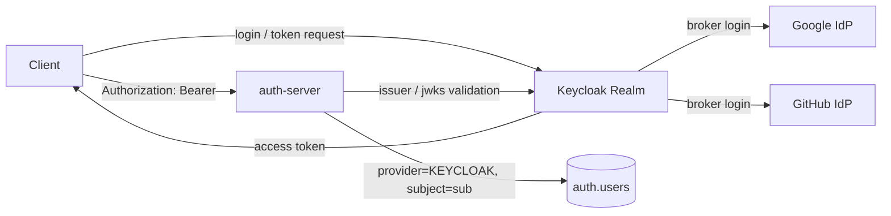

# Keycloak Resource Server 아키텍처

## Why

auth-server가 직접 로그인, OAuth2 callback, JWT 발급, issuer/JWK 공개를 모두 맡으면 인증 프로토콜과 비즈니스 사용자 식별이 강하게 섞입니다.  
이번 구조는 인증 주체를 Keycloak으로 옮기고, auth-server는 검증된 access token을 받아 내부 비즈니스 로직을 수행하는 Resource Server로 제한합니다.

## What

- Keycloak: 로그인, OAuth2 broker, issuer, token 발급, JWKS 공개를 소유합니다.
- auth-server: Spring Security Resource Server로 token signature, issuer, expiry를 검증합니다.
- application: 검증된 `sub`, `email`, `name` claim을 내부 사용자 식별자로 동기화합니다.
- infrastructure: `provider=KEYCLOAK`, `provider_subject=sub` 기준으로 users row를 조회 또는 생성합니다.

## How

`ResourceServerSecurityConfiguration`은 `/api/v1/auth/login`, `/api/v1/auth/oauth2/**`, `/oauth2/authorization/**`, `/login/oauth2/code/**`를 더 이상 열지 않습니다.  
보호 API는 Keycloak access token을 요구하고, 공개 경로는 health, Swagger, 회원가입 입력 검증 경로로 제한합니다.

`KeycloakJwtAuthenticationConverter`는 다음 claim을 프로젝트 전용 principal로 변환합니다.

- `sub` -> `AuthenticatedUser.subject`
- `email` -> `AuthenticatedUser.email`
- `name` 또는 `preferred_username` -> `AuthenticatedUser.name`
- `scope` -> `SCOPE_*`
- `realm_access.roles` -> `ROLE_*`

`GET /api/v1/auth/me`는 `@CurrentUser AuthenticatedUser`를 받아 `SyncKeycloakUserUseCase`에 최소 claim만 넘깁니다.  
이 유스케이스는 `(KEYCLOAK, sub)`가 있으면 기존 내부 사용자 id를 반환하고, 없으면 검증된 claim으로 새 내부 사용자를 생성합니다.

## Result

- auth-server 내부 JWT 발급기, 로컬 RSA key source, Vault Transit signer, 자체 OIDC discovery/JWKS endpoint를 제거했습니다.
- `/api/v1/auth/login`, `/api/v1/auth/oauth2/keycloak/*`, `/oauth2/authorization/*`, `/login/oauth2/code/*`는 더 이상 auth-server의 로그인 경로가 아닙니다.
- 클라이언트는 Keycloak에서 token을 받고 auth-server에는 Bearer token만 보냅니다.
- 내부 사용자 검증은 token signature 검증이 아니라 비즈니스 식별/동기화 문제로 분리됐습니다.
