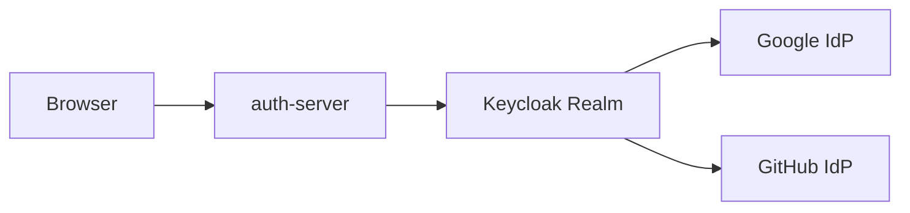

# Keycloak 아키텍처

## Why

애플리케이션이 Google, GitHub 같은 외부 provider를 각각 직접 상대하면 설정과 attribute 처리 분기가 빠르게 늘어납니다.  
이 프로젝트는 Keycloak을 broker로 두어 애플리케이션의 인증 진입점을 단순화합니다.

## What

- auth-server는 Keycloak client만 신경 씁니다.
- 소셜 provider 등록은 Keycloak Admin에서 처리합니다.
- 로컬 import 파일은 `docs/development/keycloak/realm/`에 둡니다.

## How

현재 라우트는 `/api/v1/auth/oauth2/keycloak/google`, `/api/v1/auth/oauth2/keycloak/github` 형태이며, 내부적으로 Keycloak broker 흐름으로 연결됩니다.

## Result

provider 수가 늘어나더라도 애플리케이션 레벨 복잡도를 Keycloak 경계 안으로 밀어 넣을 수 있습니다.
