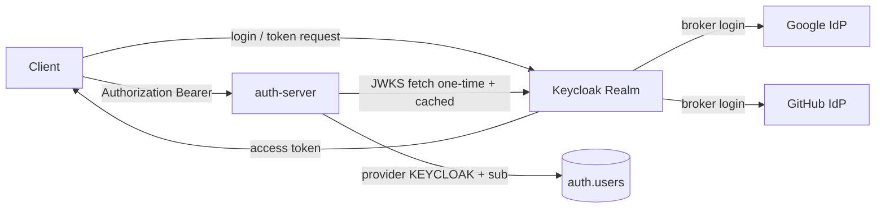

# Keycloak Resource Server 아키텍처

## Why

auth-server 가 직접 로그인, OAuth2 callback, JWT 발급, issuer / JWK 공개를 모두 맡으면 인증 프로토콜과 비즈니스 사용자 식별이 강하게 섞입니다. 이번 구조는 인증 주체를 Keycloak 으로 옮기고, auth-server 는 검증된 access token 을 받아 내부 비즈니스 로직만 수행하는 Resource Server 로 제한합니다.

## What



- Keycloak: 로그인, OAuth2 broker, issuer, token 발급, JWKS 공개를 소유합니다.
- auth-server: Spring Security Resource Server 로 token signature, issuer, expiry 를 검증합니다.
- application: 검증된 `sub`, `email`, `name` claim 으로 이미 연결된 내부 사용자를 식별합니다.
- infrastructure: `provider=KEYCLOAK`, `provider_subject=sub` 기준으로 users row 를 조회합니다.

## How

### 1. ResourceServer 설정

[`ResourceServerSecurityConfiguration`](../../../bootstrap/src/main/java/com/project/auth/config/auth/ResourceServerSecurityConfiguration.java) 가 다음을 wiring 합니다.

```java
http
    .csrf(CsrfConfigurer::disable)
    .authorizeHttpRequests(auth -> auth
        .requestMatchers("/actuator/health", "/actuator/health/**",
                         "/livez", "/readyz",
                         "/swagger-ui.html", "/swagger-ui/**", "/v3/api-docs/**").permitAll()
        .requestMatchers(HttpMethod.GET, "/api/v1/auth/me").hasRole("user")
        .anyRequest().authenticated())
    .oauth2ResourceServer(oauth2 -> oauth2
        .jwt(jwt -> jwt.jwtAuthenticationConverter(jwtAuthenticationConverter))
        .authenticationEntryPoint(securityExceptionHandler)
        .accessDeniedHandler(securityExceptionHandler));
```

핵심 설정:
- `spring.security.oauth2.resourceserver.jwt.issuer-uri=https://keycloak.dev.example.com/realms/platform`
- 이 한 줄로 Spring Boot 가 자동으로 `JwtDecoder` Bean 을 만들고, **OIDC discovery endpoint** (`/.well-known/openid-configuration`) 에서 JWKS URI 를 조회합니다.
- `NimbusJwtDecoder` 가 JWKS 를 가져와 캐시. 기본 캐시 TTL 5 분 (Spring Security 기본). Keycloak 키 회전이 일어나도 5 분 내 자동 반영.

### 2. Token 검증 체인

| 단계 | 검증 내용 | 실패 시 |
|---|---|---|
| 1 | Bearer header 형식 | 401, `WWW-Authenticate: Bearer` |
| 2 | JWT 서명 (JWKS 공개키 매칭) | 401, `invalid_token` |
| 3 | `iss` 가 설정된 issuer-uri 와 일치 | 401, `invalid_token` |
| 4 | `exp` 미만료, `nbf`/`iat` 유효 | 401, `invalid_token` |
| 5 | `aud` 가 허용 client 와 일치 (선택) | 401 |
| 6 | `KeycloakJwtAuthenticationConverter` 가 claim → `AuthenticatedUser` 변환 | — |
| 7 | `hasRole("user")` 권한 검사 | 403, `access_denied` |

1~5 는 Spring Security 가 자동, 6~7 은 본 프로젝트 코드.

### 3. Claim → Principal 변환

[`KeycloakJwtAuthenticationConverter`](../../../bootstrap/src/main/java/com/project/auth/config/auth/security/KeycloakJwtAuthenticationConverter.java) 가 다음 claim 을 프로젝트 전용 principal 로 변환합니다.

- `sub` → `AuthenticatedUser.subject`
- `email` → `AuthenticatedUser.email`
- `name` 또는 `preferred_username` → `AuthenticatedUser.name`
- `scope` → `SCOPE_*`
- `realm_access.roles` → `ROLE_*`

자세한 매핑 정책과 sample JWT payload 는 [03-claim-role-design.md](./03-claim-role-design.md).

### 4. 비즈니스 흐름

`GET /api/v1/auth/me` 는 `@CurrentUser AuthenticatedUser` 를 받아 `LoadKeycloakUserUseCase` 에 최소 claim 만 넘깁니다. 이 use case 는 `(KEYCLOAK, sub)` 로 기존 내부 사용자 id 를 조회하고, 연결된 사용자가 없으면 `AUTH-004` 404 를 반환합니다 — *자동 생성 / 자동 연결은 하지 않습니다.*

## Result

- auth-server 내부 JWT 발급기, 로컬 RSA key source, Vault Transit signer, 자체 OIDC discovery / JWKS endpoint 를 모두 제거했습니다 ([04-adr-token-ownership-cleanup.md](./04-adr-token-ownership-cleanup.md)).
- `/api/v1/auth/login`, `/api/v1/auth/oauth2/keycloak/*`, `/oauth2/authorization/*`, `/login/oauth2/code/*` 는 더 이상 auth-server 의 로그인 경로가 아닙니다.
- 클라이언트는 Keycloak 에서 token 을 받고 auth-server 에는 Bearer token 만 보냅니다.
- 내부 사용자 검증은 token signature 검증이 아니라 비즈니스 식별 / 조회 문제로 분리됐습니다.

## 운영 고려사항

- **JWKS 회전**: Keycloak 측 회전 시 5 분 내 ResourceServer 가 새 키를 fetch. 회전 직후 발급된 token 이 캐시 만료 전 도달하면 `invalid_token` 가능 — Keycloak 측 grace period 또는 `NimbusJwtDecoder` cache refresh 정책 조정 가능.
- **issuer-uri 변경**: prod 와 dev 가 서로 다른 hostname 이라 환경별 overlay 에서 주입. 이 값이 token 의 `iss` 와 한 글자라도 다르면 모든 token 이 거절됨 — 가장 흔한 운영 사고 패턴.
- **Realm role 의존**: 기본 사용자에 `user` role 이 부여되지 않으면 401 이 아니라 *401 통과 후 403* 으로 떨어짐. 운영자는 Keycloak realm 의 default-roles-platform 설정에 `user` 가 있는지 확인해야 함.
