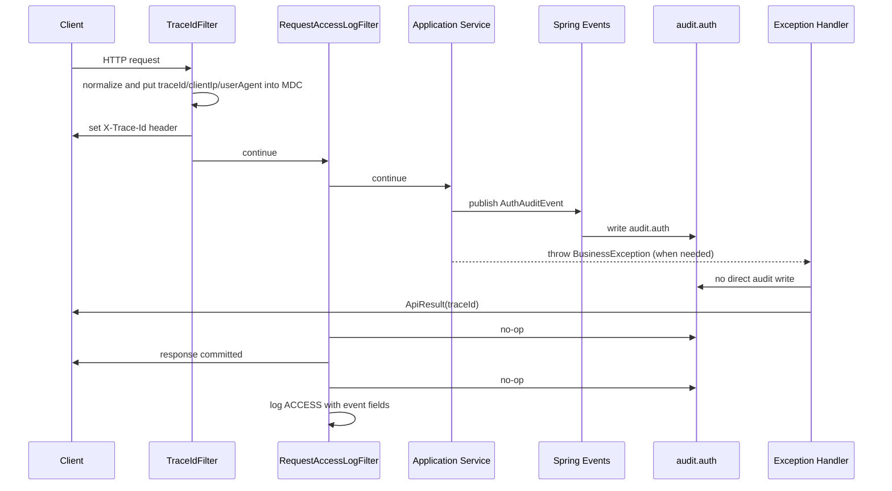

# Logging 아키텍처

## 1. Context & Scope

### 목적

이 문서는 인증 서버의 로깅 구조를 MDC 사용법, structured event field, 예외 처리 책임 분리, audit log 운영 계약 관점에서 설명합니다.  
목표는 아래 질문에 답하는 것입니다.

- 왜 `traceId`를 로그 메시지에 직접 넣지 않고 Logback 패턴에서 소비해야 하는가?
- 왜 `eventType`, `emailMasked`, `provider`, `reason`, `status`, `durationMs`, `actorId` 같은 값은 message 문자열이 아니라 structured field여야 하는가?
- 왜 서비스 레이어의 실패 로그를 audit event 발행으로 바꿨는가?
- 왜 Kubernetes에서는 `audit.auth` 파일 출력을 기본값이 아니라 opt-in profile로 내려야 하는가?
- 왜 `TraceIdFilter`가 체인 최전방에 있어야 하고, 요청 시간은 `System.nanoTime()`으로 재야 하는가?

### Scope

- 포함:
  - `TraceIdFilter`, `RequestAccessLogFilter`, `WebConfiguration`
  - `ApplicationExceptionHandler`, `InfrastructureExceptionHandler`, `SecurityExceptionHandler`
  - `AuthAuditEventPublisher`와 bootstrap audit listener
  - `logback-spring.xml`의 console pattern, structured console, `audit.auth`, optional `AUDIT_FILE`
  - `traceId`, `clientIp`, `userAgent` MDC 전파
  - audit/access structured field 정책
  - Tomcat trusted proxy 범위와 audit file opt-in 계약
- 제외:
  - ELK, Loki, Datadog 같은 외부 수집기 설정
  - OpenTelemetry, Micrometer Tracing 실제 도입
  - 조직 차원의 장기 보존 정책
  - W3C traceparent 전파와 span 생성

## 2. Why

- MDC는 "컨텍스트를 코드에서 분리"하려는 도구입니다. `MDC.get("traceId")`를 매번 로그 메시지에 다시 붙이면 MDC를 도입한 이유가 사라집니다.
- structured logging의 목적은 JSON 모양을 만드는 것이 아니라 검색과 집계 가능한 필드를 보장하는 것입니다. `LOGIN_FAILURE emailMasked=... reason=...` 같은 message 문자열은 로그 백엔드에서 `eventType`, `emailMasked`, `reason` 필드로 보장되지 않습니다.
- 서비스 레이어에서 실패를 직접 `audit.warn(...)`으로 남기고, 같은 예외를 글로벌 예외 핸들러가 다시 `warn`으로 남기면 운영 로그가 중복됩니다.
- 인증 서버의 audit log는 성공/실패 여부만으로 충분하지 않습니다. 사고 조사에는 요청자 IP, User-Agent, traceId가 같이 남아야 합니다.
- Kubernetes에서는 stdout/stderr를 cluster-level backend가 수집하는 구조가 기본 운영 모델입니다. 파일 appender를 항상 켜면 pod 로컬 디스크 유실, 중복 기록, shipper 계약 부재 문제가 생깁니다.
- 필터 최전방에서 MDC를 심지 않으면 Spring Security 안쪽에서 발생한 로그에 traceId가 빠질 수 있습니다.
- 요청 시간 측정은 시스템 시각 변경 영향을 받지 않아야 하므로 `System.currentTimeMillis()`보다 `System.nanoTime()`이 맞습니다.

결국 이번 변경의 핵심은 "로그를 더 많이 남기는 것"이 아니라, 같은 요청과 같은 보안 이벤트를 필드 기반으로 정확히 재구성할 수 있게 책임과 운영 계약을 다시 나누는 것입니다.

## 3. Goals & Non-Goals

### Goals

- traceId는 로그 메시지가 아니라 Logback 패턴에서 자동으로 붙입니다.
- audit/access의 검색 대상 값은 SLF4J key-value pair로 남겨 prod structured console에서 JSON top-level field가 되게 합니다.
- 요청 단위 메타데이터(`traceId`, `clientIp`, `userAgent`)를 정규화/축약한 뒤 MDC에 심어 access log, exception log, audit log가 같은 컨텍스트를 공유하게 합니다.
- 이메일은 `emailMasked`, 내부 사용자 식별자는 `userIdHash`, 인증 주체는 `actorId`로 축약해서 남깁니다.
- 서비스 레이어는 logger에 직접 의존하지 않고 audit event만 발행합니다.
- `audit.auth`는 기본적으로 콘솔에 기록하고, 파일 보존 계약이 있을 때만 `audit-file` profile로 롤링 파일을 추가합니다.
- `TraceIdFilter`와 `RequestAccessLogFilter`의 순서를 명시적으로 보장합니다.
- proxy 뒤의 client IP는 `server.forward-headers-strategy=native`와 `server.tomcat.remoteip.internal-proxies` 운영 설정을 통해 신뢰 범위를 제한합니다.

### Non-Goals

- 이번 변경에서 표준 분산 추적 라이브러리까지 바로 도입하는 것
- 모든 profile의 로그를 JSON 파일로 재설계하는 것
- audit event를 비동기 메시지 브로커로 내보내는 것
- 로그 수집 백엔드의 retention, index, dashboard 정책까지 결정하는 것

## 4. Architecture Overview

### 4.1 전체 구조

```mermaid
flowchart LR
  Client["Client"] --> Trace["TraceIdFilter<br/>MDC(traceId, clientIp, userAgent)"]
  Trace --> Access["RequestAccessLogFilter<br/>http.access"]
  Access --> Security["Spring Security"]
  Security --> Controller["Controllers / Presentation"]
  Controller --> App["Application Services"]
  App --> AuditPublisher["AuthAuditEventPublisher"]
  AuditPublisher --> SpringEvents["ApplicationEventPublisher"]
  SpringEvents --> AuditListener["AuthAuditEventListener"]

  Controller -. business / infra exceptions .-> ExceptionHandlers["Global Exception Handlers"]
  AuditListener -. audit.auth .-> AuditLogger["audit.auth logger"]
  ExceptionHandlers -. root logger .-> RootLogger["root logger"]
  Access -. http.access .-> AccessLogger["http.access logger"]

  AuditLogger --> Console["CONSOLE appender<br/>source of truth"]
  AuditLogger -. audit-file profile .-> AuditFile["AUDIT_FILE<br/>optional rolling file"]
  RootLogger --> Console
  AccessLogger --> Console
```

### 4.2 핵심 컴포넌트

- `TraceIdFilter`
  - 32자리 lowercase hex traceId를 생성합니다.
  - `traceId`, 축약된 `clientIp`, 정규화된 `userAgent`를 MDC에 넣습니다.
  - `X-Trace-Id` 응답 헤더를 설정합니다.
- `RequestAccessLogFilter`
  - 요청 종료 시 `eventType=HTTP_ACCESS`, `method`, `requestPath`, `status`, `durationMs`, `remoteIp`, `actorId`, `result`를 `http.access` event field로 남깁니다.
  - traceId는 메시지에 넣지 않고 패턴이 자동 출력합니다.
- `AuthAuditEventPublisher`
  - 서비스 레이어가 성공/실패 audit event를 발행하는 포트입니다.
- bootstrap audit listener
  - Spring event를 받아 `audit.auth`로 기록합니다.
  - `eventType`과 event fields를 SLF4J key-value pair로 올립니다.
  - 서비스는 logger를 몰라도 됩니다.
- `logback-spring.xml`
  - 콘솔 패턴에 `%X{traceId}`를 넣습니다.
  - non-prod plain console과 optional audit file에는 `%kvp`를 넣어 key-value field를 볼 수 있게 합니다.
  - prod profile에서는 Spring Boot structured console appender를 사용합니다.
  - `audit-file` profile에서만 `audit.auth`에 `AUDIT_FILE`을 추가합니다.

## 5. How It Works

### 5.1 요청/데이터 흐름



### 5.2 상세 설계

#### MDC는 패턴에서 소비한다

`traceId`는 더 이상 `ApplicationExceptionHandler`, `RequestAccessLogFilter`, `SecurityExceptionHandler` 메시지 안에 직접 들어가지 않습니다.

- 일반 로그:
  - `CONSOLE_LOG_PATTERN`이 `%X{traceId:-}`를 출력
- audit 파일:
  - `AUDIT_FILE_PATTERN`이 `%X{traceId:-} %X{clientIp:-} %X{userAgent:-}`와 `%kvp`를 출력

이 구조의 장점은 로그 메시지가 비즈니스 의미만 담고, 상관관계 컨텍스트는 로깅 인프라가 일관되게 관리한다는 점입니다.

#### 의미 필드는 SLF4J key-value pair로 올린다

prod profile의 `structured-console-appender.xml`은 Spring Boot structured logging encoder를 사용합니다.  
이 encoder는 MDC와 SLF4J key-value pair를 JSON top-level member로 출력합니다.

따라서 access log는 message를 `ACCESS`로만 두고 아래 값을 event field로 남깁니다.

- `eventType=HTTP_ACCESS`
- `method`
- `requestPath`
- `status`
- `durationMs`
- `remoteIp`
- `actorId`
- `result`

audit log도 `LOGIN_FAILURE emailMasked=... reason=...`처럼 문자열을 합치지 않습니다.  
`AuthAuditEventLogListener`가 `eventType`과 event fields를 key-value pair로 추가하고, message는 event type만 둡니다.

민감 식별자는 아래 기준을 적용합니다.

- 이메일: 원문 대신 `emailMasked`로 기록합니다. 예: `te***@example.com`
- 내부 사용자 ID: 원문 대신 `userIdHash`로 기록합니다.
- HTTP/security principal: `actorId`로 기록하며 이메일이면 마스킹하고 그 외 값은 짧은 SHA-256 해시로 축약합니다.
- IP 주소: IPv4는 마지막 octet을 `0`으로 바꾸고, IPv6/기타 값은 짧은 SHA-256 해시로 축약합니다.
- User-Agent, path, reason: CR/LF, 공백, 제어문자, `=`, `|`를 `_`로 치환하고 길이를 제한합니다.

이렇게 하면 운영 백엔드에서 아래 쿼리가 message parsing 없이 가능합니다.

```text
eventType = LOGIN_FAILURE AND reason = invalid_password
status >= 500 AND actorId = al***@example.com
provider = github AND eventType = OAUTH_LOGIN_SUCCESS
```

#### 서비스 레이어는 logger 대신 audit event를 발행한다

`LoginService`, `SignUpService`, `OAuthLoginService`는 더 이상 `slf4j-api`에 직접 의존하지 않습니다.

- 성공/실패 사실이 필요하면 `AuthAuditEventPublisher`로 semantic event를 발행합니다.
- 예외 자체는 그대로 던집니다.
- 글로벌 예외 핸들러는 root logger에서 한 번만 경고/오류를 남깁니다.

이렇게 나누면 같은 실패가 "서비스 logger + 예외 핸들러 logger"로 중복되지 않고, audit stream은 여전히 별도로 유지됩니다.

#### audit file은 opt-in 운영 계약으로 둔다

`audit.auth`의 기본 source of truth는 콘솔입니다.

prod profile에서는 콘솔이 structured JSON으로 나가고, Kubernetes에서는 이 stdout/stderr를 cluster-level logging backend가 수집하는 모델을 전제로 합니다.  
파일 appender는 아래 조건이 있을 때만 `audit-file` profile로 추가합니다.

- persistent volume에 보존한다.
- 또는 file shipper가 `app.logging.audit.file` 경로를 수집한다.
- console + file 중복 기록 비용을 감수할 이유가 있다.

`audit-file` profile을 켜면 `AUDIT_FILE`은 아래 정책을 사용합니다.

- `app.logging.audit.file`
- `SizeAndTimeBasedRollingPolicy`
- 기본값 `./logs/audit/auth.log`

파일 패턴도 `%kvp`를 포함하므로 event fields는 눈으로 확인할 수 있습니다.  
다만 파일은 JSON structured source가 아니라 운영 보조 채널입니다. Kubernetes에서 장기 보존과 검색의 기준은 structured console 수집 backend입니다.

#### 필터 순서와 시간 측정

`WebConfiguration`은 아래 순서를 사용합니다.

1. `TraceIdFilter`: `Ordered.HIGHEST_PRECEDENCE`
2. `RequestAccessLogFilter`: `Ordered.HIGHEST_PRECEDENCE + 1`

이 순서 덕분에 Spring Security, controller, exception handler, access log 모두 같은 MDC를 공유합니다.

요청 시간은 `System.nanoTime()`으로 측정합니다.  
이 값은 시간 동기화나 시스템 시각 변경의 영향을 받지 않으므로 duration 계산에 적합합니다.

#### traceId 생성 방식

기존 16자리 hex custom 값 대신 128-bit trace id에 맞춘 32자리 lowercase hex 값을 생성합니다.

- `ThreadLocalRandom.current().nextLong()` 두 개를 사용합니다.
- `HexFormat.of().toHexDigits(...)`로 각 64-bit 값을 16자리 hex로 변환합니다.
- 두 값이 모두 0인 경우는 W3C trace id에서 허용되지 않으므로 다시 생성합니다.

현재 필터가 W3C `traceparent`를 전파하거나 span을 만들지는 않습니다.  
다만 `traceId`라는 이름을 유지하는 이상, 나중에 Micrometer Tracing 또는 OpenTelemetry를 도입할 때 불필요한 포맷 이행을 줄이기 위해 32-hex 형식으로 맞춥니다.

#### remoteIp는 trusted proxy 설정에 의존한다

애플리케이션 코드는 `X-Forwarded-For`를 직접 읽지 않고 `request.getRemoteAddr()`만 사용합니다.  
실제 client IP 정규화는 아래 설정에 맡깁니다.

- `server.forward-headers-strategy=native`
- `server.tomcat.remoteip.internal-proxies=${SERVER_TOMCAT_REMOTEIP_INTERNAL_PROXIES:...}`

운영 환경은 ingress, service mesh, load balancer 대역을 `SERVER_TOMCAT_REMOTEIP_INTERNAL_PROXIES`로 명시해야 합니다.  
이 값이 틀리면 access log의 `remoteIp`와 MDC의 `clientIp`는 ingress IP이거나 신뢰하면 안 되는 forwarded header 결과가 될 수 있습니다.

#### 표준 분산 추적 라이브러리는 다음 단계다

이번 변경은 커스텀 MDC 파이프라인을 정리하는 수준입니다.  
W3C trace context, downstream propagation, span model이 필요해지면 `Micrometer Tracing`이나 OpenTelemetry 계열 도입이 더 적절합니다.

## 6. Alternatives Considered

### 대안 1

- 구조:
  `MDC.get("traceId")`를 각 로그 메시지에 직접 삽입
- 장점:
  눈에 바로 보여서 구현이 단순해 보입니다.
- 단점:
  컨텍스트가 코드 전역에 침투하고, 메시지 형식이 제각각이 되며, MDC의 존재 이유가 사라집니다.
- 왜 선택하지 않았는가:
  traceId는 패턴에서 일괄 처리하는 편이 더 일관되고 유지보수가 쉽습니다.

### 대안 2

- 구조:
  audit/access 주요 값을 `message`에 `key=value` 문자열로 합쳐 넣음
- 장점:
  plain console에서 바로 보이고 구현량이 가장 적습니다.
- 단점:
  로그 백엔드가 `eventType`, `reason`, `status`, `actorId`를 필드로 보장하지 못하고 regex parsing에 의존합니다.
- 왜 선택하지 않았는가:
  인증 서버 운영에서 필요한 것은 문자열 검색보다 provider별 성공률, reason별 실패율, 5xx access log 같은 필드 기반 집계입니다.

### 대안 3

- 구조:
  audit/access 주요 값을 모두 MDC에 넣고 로그 직후 제거
- 장점:
  Spring Boot structured console이 MDC를 top-level field로 내보내므로 요구사항을 만족할 수 있습니다.
- 단점:
  이벤트 한 건에만 속하는 값이 thread context에 섞입니다. 실수로 scope를 닫지 않으면 다음 로그로 새기 쉽습니다.
- 왜 선택하지 않았는가:
  `traceId`, `clientIp`, `userAgent`처럼 요청 전체에 유효한 값은 MDC에 두고, `status`, `reason`, `provider`처럼 로그 이벤트에만 유효한 값은 SLF4J key-value pair로 두는 편이 책임이 분명합니다.

### 대안 4

- 구조:
  서비스 레이어가 `audit.auth` logger를 직접 사용
- 장점:
  구현량이 적습니다.
- 단점:
  비즈니스 실패와 예외 처리 로그가 결합되고, 테스트도 logger 구현에 끌려갑니다.
- 왜 선택하지 않았는가:
  audit event 발행으로 바꾸면 서비스는 의미만 표현하고, 실제 기록은 bootstrap이 담당할 수 있습니다.

### 대안 5

- 구조:
  바로 `Micrometer Tracing`을 도입
- 장점:
  표준 헤더 처리와 MDC 주입이 더 견고합니다.
- 단점:
  이번 브랜치의 책임 범위를 크게 넓히고, 운영 도구 선택까지 함께 결정해야 합니다.
- 왜 선택하지 않았는가:
  현재는 로그 책임 분리와 audit 영속성 정리가 먼저였습니다.

### 대안 6

- 구조:
  `AUDIT_FILE`을 모든 profile에서 항상 켬
- 장점:
  VM 또는 단일 서버 운영에서는 별도 파일을 곧바로 확인할 수 있습니다.
- 단점:
  Kubernetes에서는 pod 재시작 시 파일 유실, console과 file 중복 기록, file shipper 부재 문제가 생깁니다.
- 왜 선택하지 않았는가:
  현재 운영 기본값은 console 수집을 기준으로 두고, 파일 보존 계약이 있는 환경만 `audit-file` profile로 명시하는 편이 안전합니다.

## 7. Cross-cutting Concerns

- 성능:
  - traceId 생성은 `UUID` 문자열 가공 대신 `ThreadLocalRandom + HexFormat`을 사용합니다.
  - duration은 `System.nanoTime()`으로 계산합니다.
- 보안:
  - audit/access structured field에 축약된 `clientIp`, 정규화된 `userAgent`, 축약된 `remoteIp`, 축약된 `actorId`를 기록합니다.
  - 이메일은 `emailMasked`, 사용자 ID는 `userIdHash`로만 기록합니다.
  - `request.getRemoteAddr()`는 컨테이너가 정규화한 값을 사용합니다.
  - trusted proxy 범위는 `SERVER_TOMCAT_REMOTEIP_INTERNAL_PROXIES`로 운영 환경에서 명시합니다.
- 테스트:
  - `TraceIdFilterTest`는 32-hex traceId, MDC 전파, User-Agent 정규화를 검증합니다.
  - `RequestAccessLogFilterTest`는 access 값이 message가 아니라 key-value pair로 올라가고 principal이 `actorId`로 축약되는지 확인합니다.
  - `LoggingConfigurationSmokeTest`는 prod structured encoder가 MDC와 key-value pair를 JSON top-level field로 출력하는지 확인합니다.
  - 서비스 단위 테스트는 audit event가 `emailMasked`, `userIdHash`를 발행하는지 검증합니다.
- 운영:
  - Kubernetes에서는 structured console 수집 backend를 기준으로 확인합니다.
  - audit file은 persistent volume 또는 file shipper 계약이 있을 때만 `audit-file` profile로 켭니다.
  - dev actuator는 별도 runbook으로 검증합니다.

## 8. Result / Trade-offs

- 얻은 이점:
  - traceId가 로그 메시지 포맷에 침투하지 않습니다.
  - audit/access 핵심 값이 prod JSON 로그의 top-level structured field가 됩니다.
  - email, principal, User-Agent 같은 식별자와 외부 입력이 원문으로 로그 포맷에 삽입되지 않습니다.
  - 서비스 레이어의 실패 로깅과 글로벌 예외 로깅 책임이 분리됩니다.
  - traceId가 32-hex 형식이 되어 추후 tracing 도입 비용이 줄어듭니다.
  - audit file이 명시적 운영 계약이 있는 환경에서만 켜집니다.
  - 요청자 IP, User-Agent가 audit/access 컨텍스트에 자동 포함됩니다.
- 감수한 비용:
  - audit event 포트와 listener라는 중간 계층이 하나 추가되었습니다.
  - `logback-spring.xml` 설정이 이전보다 복잡해졌습니다.
  - plain console에서는 key-value pair가 `%kvp` 형식으로 보이고, 운영 집계 기준은 prod structured console입니다.
- 남은 리스크:
  - `SERVER_TOMCAT_REMOTEIP_INTERNAL_PROXIES`가 실제 ingress/proxy 대역과 다르면 client IP 신뢰도가 떨어집니다.
  - optional 로컬 파일은 외부 보안 로그 저장소를 완전히 대체하지 못합니다.
  - 서비스 간 분산 추적이 필요해지면 표준 tracing 도입이 필요합니다.

## 9. References

- 관련 코드:
  - `bootstrap/src/main/java/com/project/auth/config/web/TraceIdFilter.java`
  - `bootstrap/src/main/java/com/project/auth/config/web/RequestAccessLogFilter.java`
  - `bootstrap/src/main/java/com/project/auth/config/logging/AuthAuditLoggingConfiguration.java`
  - `bootstrap/src/main/resources/logback-spring.xml`
  - `application/src/main/java/com/project/auth/application/support/audit/AuthAuditEvent.java`
  - `presentation/src/main/java/com/project/auth/presentation/support/exception/ApplicationExceptionHandler.java`
- 관련 문서:
  - [02-runbook-log-correlation-and-dev-actuator.md](./02-runbook-log-correlation-and-dev-actuator.md)
  - [../02-clean-architecture/02-error-handling.md](../02-clean-architecture/02-error-handling.md)
