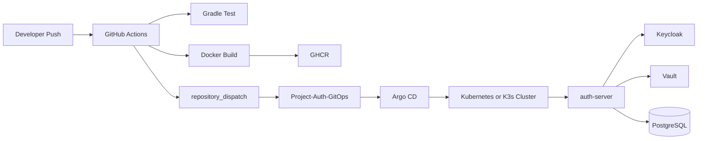

# Full Pipeline

## Why

이 프로젝트는 앱 코드, 이미지 빌드, GitOps, 클러스터 반영이 서로 다른 저장소와 도구를 거쳐 이어집니다.  
전체 흐름을 한 장으로 설명할 수 있어야 운영 경계와 책임을 분명히 말할 수 있습니다.

## End-to-end Flow

## What

- 앱 저장소는 테스트, 이미지 빌드, 이미지 발행까지 담당합니다.
- GitOps 저장소는 배포 대상 태그와 Kubernetes 선언을 관리합니다.
- Argo CD는 GitOps 저장소의 원하는 상태를 클러스터에 반영합니다.
- 애플리케이션은 런타임에서 Keycloak, Vault, PostgreSQL과 상호작용합니다.

## Repo Boundary

- 이 저장소: 애플리케이션 코드, 로컬 개발 환경, 문서
- `Project-Auth-GitOps`: 운영 선언과 환경별 배포 상태

## Result

코드 변경과 운영 선언 변경의 책임이 분리되지만, 전체 파이프라인을 설명하는 별도 문서가 없으면 흐름이 끊겨 보이기 쉽습니다.  
이 문서는 그 연결 지점을 보여주는 기준 문서입니다.
